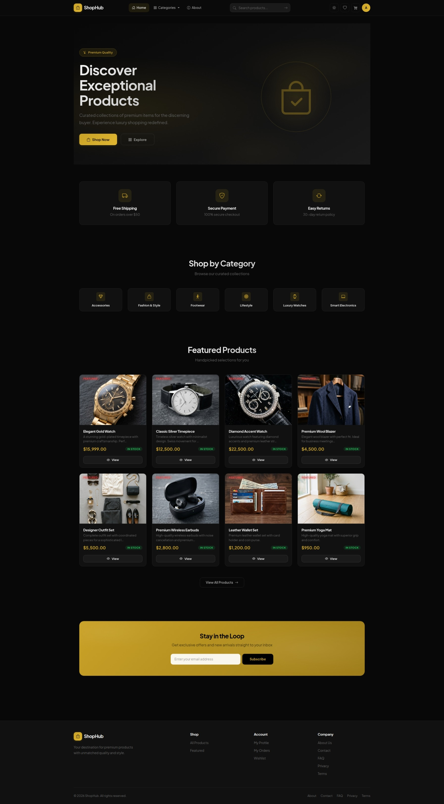

# 1. Introduction

## 1.1 Project Overview

The E-commerce platform presented in this project is a full-stack web application built on ASP.NET Core 10.0 MVC. It provides a complete online shopping experience including product browsing, cart management, order processing, payment handling, and an administrative dashboard. The system also integrates an AI-powered product assistant using the Google Gemini API.

The project was designed with two primary goals. First, to create a production-ready E-commerce system that a small business could deploy and use to sell products online. Second, to serve as a comprehensive demonstration of modern ASP.NET Core development patterns including the repository pattern, unit of work, Entity Framework Core with SQL Server, ASP.NET Core Identity for authentication, dependency injection throughout, and third-party API integration for payments and AI.

The decision to build the platform from scratch rather than using a hosted solution like Shopify or WooCommerce was intentional. Building from scratch gives full control over the database schema, the business logic, the UI, and the hosting environment. It also avoids monthly subscription fees and platform-specific limitations such as restricted access to customer data or forced use of specific payment gateways.

The application is structured into three logical layers:

- **Controllers** handle HTTP requests and responses. They validate input, call service methods, and return views or JSON responses.
- **Services** contain the business logic. They orchestrate operations that span multiple repositories or interact with external APIs.
- **Repositories** abstract data access behind interfaces. They use Entity Framework Core to query SQL Server and return domain models.

This separation follows the single responsibility principle. Each layer has a distinct job, and changes to one layer (for example, switching from SQL Server to PostgreSQL) ideally affect only the repository layer.

## 1.2 Problem Statement

Small and medium businesses in Egypt and the broader Middle East face a specific set of challenges when trying to sell online. Understanding these challenges is important because they directly shaped the feature set of this project.

The first challenge is payment methods. Credit card penetration in Egypt is low. According to data from the Central Bank of Egypt, card-carrying adults represent less than 10% of the population. The dominant payment method for online shopping is cash on delivery (COD). Customers want to order online and pay in cash when the package arrives. Global platforms like Amazon Egypt offer COD for some items, but smaller merchants using self-hosted solutions often struggle to add COD support because it requires manual order management.

The second challenge is cost. Hosted E-commerce platforms charge recurring fees. Shopify starts at $39 per month plus transaction fees. WooCommerce is free as a plugin but requires WordPress hosting, a domain name, and often paid extensions for features like Stripe integration or advanced shipping. For a small business testing the online market, these costs can be prohibitive.

The third challenge is technical control. Using a hosted platform means the business does not own the customer data in a directly accessible format. Exporting data is possible but requires platform-specific tools. Customizing the checkout flow or adding a new payment method requires the platform's permission and often developer fees.

The fourth challenge is localization. Many global platforms do not handle Arabic content well. The UI layout changes for right-to-left languages, currency formatting varies by country, and local tax rules (like Egypt's 14% VAT) are not always supported out of the box.

This project addresses these challenges by providing:

1. Cash on delivery as a built-in payment method alongside Stripe credit card processing
2. A self-hosted solution with no recurring platform fees
3. Full source code access and database control
4. Support for 14% VAT calculation built into the order pipeline
5. An admin panel designed for managing orders, products, and customers without third-party tools

## 1.3 Project Objectives

The project was built to meet the following objectives. Each objective maps to one or more modules in the final system.

**Objective 1: Product Catalog with Filtering and Search**

The system must allow customers to browse products by category, search by name or description, filter by price range, and sort by price or name. The product listing must support pagination and load quickly even with hundreds of products. Category-based browsing should work both from the homepage and through a dedicated category page.

**Objective 2: Shopping Cart Management**

Authenticated users must be able to add products to a cart, update quantities, remove items, and clear the cart. The cart must persist across sessions and show a running total including tax. Variant-based products (different sizes or colors) must be supported with separate stock tracking per variant.

**Objective 3: Order Processing with Payment**

The system must handle the full order lifecycle: checkout form with shipping details, promo code validation, order creation, payment processing, and order confirmation. Two payment methods must be supported: credit card via Stripe Checkout and cash on delivery. Orders must be stored with full line-item detail for future reference.

**Objective 4: User Account Management**

Users must be able to register, log in, reset their password via email, update their profile, change their password, and delete their account. Authentication must use ASP.NET Core Identity with role-based authorization separating customers from administrators.

**Objective 5: Admin Dashboard**

Administrators must have a dedicated panel for managing products, categories, orders, users, and promo codes. The dashboard must show key metrics: total revenue, order counts by status, top-selling products, recent orders, and sales charts.

**Objective 6: AI-Powered Product Assistant**

The system must integrate a generative AI assistant that customers can use to ask questions about products. The assistant must be context-aware, responding based on the product name and description, and must handle API errors gracefully including rate limiting.

**Objective 7: Concurrency-Safe Stock Management**

The system must prevent stock overselling when two customers place orders for the same product simultaneously. This must be handled at the database level using row versioning and optimistic concurrency with automatic retry logic.

## 1.4 System Scope

The application covers the following modules. Each module is a distinct functional area with its own controller, views, and data access logic.

**Product Catalog**

The catalog module handles product listing, detail views, filtering, and search. Products are organized into categories. Each product has a name, description, price, stock count, image, and optional variants. Featured products are highlighted on the homepage. The catalog supports server-side pagination with 12 products per page. AJAX filtering was added to improve the browsing experience by avoiding full page reloads when filters change.

**Shopping Cart**

The cart module manages the user's selected items. It supports adding products with a specific quantity, updating quantities, removing individual items, and clearing the entire cart. When a product has variants (size or color), the user selects the variant before adding to cart. Stock is checked at add time to prevent adding more items than available.

**Checkout and Orders**

The checkout module collects shipping information, validates promo codes, calculates totals with tax, and processes payment. For COD orders, the order is confirmed immediately. For credit card orders, the user is redirected to Stripe Checkout and the order is confirmed on successful return. Order confirmation emails are sent asynchronously.

**User Accounts**

Built on ASP.NET Core Identity, the accounts module handles registration, login, logout, password reset, profile updates, and account deletion. Role management separates Admin and Customer access. The profile page shows order history, wishlist count, and account statistics.

**Admin Panel**

The admin panel provides full CRUD for products, categories, and promo codes. It includes order management with status updates and user management with activate/deactivate controls. The analytics dashboard shows revenue metrics, order statistics, top products, top customers, and category performance with Chart.js visualizations.

**AI Assistant**

The AI assistant is accessible from any product detail page. Users click a button to open a modal, type a question about the product, and receive an AI-generated answer. The backend calls the Google Gemini API with a prompt built from the product name and description.

**Wishlist**

The wishlist module lets users save products for later. It supports adding and removing items via AJAX, checking if a product is in the wishlist, and displaying the wishlist count in the navigation bar.

## 1.5 Technology Stack

The following table lists the key technologies used in this project along with the specific version and purpose.

| Layer | Technology | Version | Purpose |
|---|---|---|---|
| Backend Framework | ASP.NET Core MVC | 10.0 | Web application framework |
| Object-Relational Mapping | Entity Framework Core | 10.0 | Database access and migration |
| Database | SQL Server | 2022 | Relational data storage |
| Authentication | ASP.NET Core Identity | 10.0 | User management and roles |
| Payments | Stripe SDK | Latest | Credit card payment processing |
| AI | Google Gemini API | v1beta | Product assistant |
| Frontend CSS | Bootstrap | 5.3 | Responsive layout and components |
| Frontend Icons | Bootstrap Icons | 1.11 | UI icon set |
| Charts | Chart.js | 4.4 | Admin analytics charts |
| Caching | In-Memory Cache | Built-in | Category and featured product caching |
| HTTP Client | HttpClientFactory | Built-in | Gemini API communication |
| Email | System.Net.Mail.SmtpClient | Built-in | Transactional email sending |

The entry point of the application is `Program.cs`, which configures services, middleware, and the request pipeline.

```csharp
var builder = WebApplication.CreateBuilder(args);

builder.Services.AddDbContext<ApplicationDbContext>(options =>
    options.UseSqlServer(builder.Configuration.GetConnectionString("DefaultConnection")));

builder.Services.AddIdentity<ApplicationUser, IdentityRole>(options =>
{
    options.Password.RequireDigit = true;
    options.Password.RequiredLength = 6;
    options.Password.RequireLowercase = true;
    options.Password.RequireUppercase = true;
    options.User.RequireUniqueEmail = true;
})
.AddEntityFrameworkStores<ApplicationDbContext>()
.AddDefaultTokenProviders();

builder.Services.AddScoped<IUnitOfWork, UnitOfWork>();
builder.Services.AddScoped<IEmailService, EmailService>();
builder.Services.AddScoped<IPaymentService, StripePaymentService>();
builder.Services.AddScoped<IAnalyticsService, AnalyticsService>();
builder.Services.AddScoped<IImageService, ImageService>();
builder.Services.AddScoped<IGeminiService, GeminiService>();

builder.Services.AddMemoryCache();
builder.Services.AddResponseCaching();
builder.Services.AddControllersWithViews();

var app = builder.Build();

if (!app.Environment.IsDevelopment())
{
    app.UseExceptionHandler("/Home/Error");
    app.UseHsts();
}

app.UseHttpsRedirection();
app.UseStaticFiles();
app.UseResponseCaching();
app.UseRouting();
app.UseAuthentication();
app.UseAuthorization();
app.MapControllerRoute("default", "{controller=Home}/{action=Index}/{id?}");

app.Run();
```

The `Program.cs` file is divided into three sections. The first section registers services with the dependency injection container. The second section configures the middleware pipeline. The third section seeds the database with initial data (admin user, sample categories, and products).

Service registration uses the scoped lifetime because `IUnitOfWork` and the services that depend on it should be created once per HTTP request and disposed when the request ends. `IMemoryCache` and `IHttpClientFactory` are singletons, shared across all requests.

The middleware pipeline order is important. `UseAuthentication` and `UseAuthorization` are placed between `UseRouting` and `UseMapControllerRoute`. This ensures that the authorization middleware can inspect the route before deciding whether to allow access. `UseResponseCaching` is placed before `UseRouting` so that cached responses can be served without executing the MVC pipeline.

## 1.6 System Architecture & Primary User Interface

The following system architecture flowchart illustrates the relationships between the client-side browser, MVC controllers, application business services, the repository/data access layer, SQL Server database, and external APIs (Google Gemini, Stripe, and SMTP).

```mermaid
graph TD
    classDef client fill:#1f77b4,stroke:#0d47a1,stroke-width:2px,color:#fff;
    classDef controller fill:#ff7f0e,stroke:#e65100,stroke-width:2px,color:#fff;
    classDef service fill:#2ca02c,stroke:#1b5e20,stroke-width:2px,color:#fff;
    classDef repository fill:#d62728,stroke:#b71c1c,stroke-width:2px,color:#fff;
    classDef database fill:#9467bd,stroke:#4a148c,stroke-width:2px,color:#fff;
    classDef external fill:#bcbd22,stroke:#827717,stroke-width:2px,color:#fff;

    Client[Client Browser / Desktop & Mobile]:::client

    subgraph "ASP.NET Core 10.0 MVC Monolithic Application"
        Controllers[MVC Controllers<br/>Home, Products, Cart, Checkout, Admin, AI]:::controller
        
        subgraph "Services & Business Logic"
            GeminiService[GeminiService<br/>IGeminiService]:::service
            PaymentService[StripePaymentService<br/>IPaymentService]:::service
            EmailService[EmailService<br/>IEmailService]:::service
            AnalyticsService[AnalyticsService<br/>IAnalyticsService]:::service
        end
        
        subgraph "Data Access Layer"
            UoW[Unit of Work<br/>IUnitOfWork]:::repository
            Repos[Generic Repositories<br/>IRepository&lt;T&gt;]:::repository
        end
    end

    SQLServer[(SQL Server Database<br/>ECommerceDb)]:::database
    StripeAPI[Stripe Gateway API]:::external
    GeminiAPI[Google Gemini API v1beta]:::external
    GmailSMTP[Gmail SMTP Server]:::external

    %% Connections
    Client <=>|HTTPS Request / HTML & AJAX| Controllers
    
    Controllers --> GeminiService
    Controllers --> PaymentService
    Controllers --> EmailService
    Controllers --> AnalyticsService
    Controllers --> UoW
    
    GeminiService --> GeminiAPI
    PaymentService --> StripeAPI
    EmailService --> GmailSMTP
    
    UoW --> Repos
    Repos -->|EF Core 10.0 ORM| SQLServer
```

To provide an immediate understanding of the visual style and design aesthetics of the developed application, the homepage design is presented below. It features the responsive glassmorphism header, the hero banner with a dynamic visual ring, and the auto-fill grids for categories and featured products:



---

## 1.7 Report Organization

This book is divided into seven detailed sections:

- **Section 1** (this section) introduces the project, defines the problem it solves, lists the objectives, and describes the scope, technology stack, high-level architecture, and the primary user interface.
- **Section 2** presents background research on existing E-commerce platforms including Amazon, Noon, and eBay. It analyzes their business models, technical architectures, and limitations, compares them to our custom system, and highlights our competitive advantages.
- **Section 3** describes the frontend implementation. It covers the Razor view structure, Bootstrap 5 layout, AJAX filtering, responsive design, and JavaScript features including the cart, wishlist, and the AI assistant modal.
- **Section 4** focuses on the AI integration. It explains how the Google Gemini API is called from ASP.NET Core, how the prompt is constructed, how rate limiting and errors are handled, and the security measures around the API.
- **Section 5** covers the backend architecture in detail. It includes the database schema with all entity models, the repository and unit of work patterns, controller logic for each module, authentication and authorization configuration, payment processing with Stripe and COD, concurrency control with row versioning, and core support services.
- **Section 6** details the Agile development methodology, including 36 user stories across 7 epics, and presents a complete visual walkthrough of the designed system's screens and step-by-step user interaction steps.
- **Section 7** presents system modeling and diagrams, including the Entity-Relationship Diagram (ERD), System Use Case Diagram, Checkout Sequence Diagram, and the overall System Program Flowchart.

