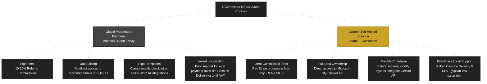

# 2. Background Research

## 2.1 Overview of Global E-commerce Platforms

Before designing this system, it was important to understand the existing landscape of E-commerce platforms. The three largest platforms — Amazon, Noon, and eBay — each operate with different business models and technical architectures. Studying their strengths and weaknesses helped identify the features that a custom ASP.NET Core platform should prioritize.

## 2.2 Amazon

Amazon is the largest online retailer globally by revenue and market capitalization. It operates a hybrid model: Amazon sells its own inventory (first-party) and also allows third-party merchants to list products on the platform (third-party marketplace).

### 2.2.1 Business Model

Amazon's third-party marketplace allows merchants to create product listings, set prices, and fulfill orders either through Amazon's Fulfillment by Amazon (FBA) service or through their own shipping. Amazon charges referral fees that vary by category, typically around 15% of the sale price. Merchants also pay additional fees for FBA storage, shipping, advertising, and subscription fees for professional selling accounts.

The platform's revenue comes from multiple sources: referral fees, subscription fees (Amazon Prime), advertising (sponsored products), and cloud services (AWS). This diversification allows Amazon to operate profitably even if the marketplace itself runs on thin margins.

### 2.2.2 Technical Architecture

Amazon's technical infrastructure is proprietary and not publicly documented in detail. However, several architectural characteristics are known from published papers and talks:

- **Microservices**: Amazon migrated from a monolithic architecture to microservices in the early 2000s. Each service owns its data and communicates through defined APIs.
- **Distributed databases**: Amazon uses DynamoDB (its own NoSQL database) for the shopping cart and session management, and a relational database layer for order processing and inventory.
- **Recommendation engine**: The product recommendation system processes user behavior data (views, purchases, searches) to generate personalized suggestions. This is one of Amazon's most valuable technical assets and is credited with driving 30% of total sales.
- **Search indexing**: Product search uses a custom search index with faceted filtering, spell correction, and ranked results based on relevance and sales velocity.

### 2.2.3 Limitations for Small Merchants

For a small business in Egypt, Amazon has several disadvantages:

- Referral fees of 15% significantly reduce profit margins, especially for low-cost items
- The merchant has no direct access to customer email addresses or purchase history — Amazon owns the customer relationship
- Customizing the storefront beyond basic branding options is not possible
- COD support on Amazon Egypt is limited to certain products and regions
- The seller dashboard provides standard reports but cannot be extended with custom analytics

## 2.3 Noon

Noon is an E-commerce platform founded in 2017 by Mohamed Alabbar (Emaar Properties) with investment from the Public Investment Fund of Saudi Arabia. It operates primarily in Saudi Arabia, the United Arab Emirates, and Egypt.

### 2.3.1 Business Model

Noon follows a similar model to Amazon: it sells first-party inventory and hosts third-party merchants. Noon differentiates itself through:

- Same-day delivery in major Gulf cities
- COD as a standard payment option across all markets
- Arabic-first user interface with full right-to-left support
- Local customer service centers in each market

Noon does not disclose its fee structure publicly, but estimates suggest referral fees of 10-20% depending on the category.

### 2.3.2 Technical Architecture

Noon is built on a combination of open-source and commercial technologies. The frontend is built with React and the backend uses Java-based microservices. The platform runs on cloud infrastructure and uses Elasticsearch for product search.

### 2.3.3 Relevance to This Project

Noon's success in the Middle East validates several design decisions made in this project:

- COD is not a niche payment method — it is a requirement for the Middle Eastern market
- Arabic support and local currency formatting matter for user adoption
- Fast delivery is a competitive advantage, which means the admin panel needs efficient order management to help merchants process orders quickly

## 2.4 eBay

eBay operates a different model from Amazon and Noon. It is primarily a peer-to-peer marketplace for both new and used goods, supporting both fixed-price listings and auctions.

### 2.4.1 Business Model

eBay charges insertion fees for listings (up to a certain number per month are free) and final value fees when an item sells, typically 10-15% of the sale price. Unlike Amazon, eBay does not hold inventory or fulfill orders — all transactions are between the buyer and seller directly.

### 2.4.2 Technical Architecture

eBay's architecture has evolved from a single monolithic Perl application in the 1990s to a Java-based microservices platform. Known technical details include:

- A search infrastructure that indexes billions of listings in near real-time
- A feedback and reputation system that tracks buyer and seller trustworthiness
- API access for third-party developers to create listing tools and analytics dashboards

### 2.4.3 Limitations

eBay's auction model is not suitable for a fixed-price retail store. The platform is also known for buyer protection policies that can favor buyers over sellers in disputes. For a small business wanting to build a brand, eBay provides limited branding control and no direct customer relationship.

## 2.5 Technical Gap Analysis and Platform Comparison

Comparing the three major platforms to a custom ASP.NET Core solution highlights how a custom self-hosted system bridges key operational and financial gaps for local merchants.

The flowchart below categorizes the trade-offs between utilizing proprietary global platforms (Amazon, Noon, eBay) and deploying our custom, self-hosted system (Ataba):



Below is the comparative table detailing the specific technical and financial metrics of each platform versus our proposed system:

| Feature | Amazon | Noon | eBay | This Project (Ataba) |
|---|---|---|---|---|
| Monthly subscription fee | Professional account $39.99/month | Commission-based | Store subscription $4.95-$27.95/month | None |
| Per-transaction fee | 15% average referral fee | 10-20% estimated | 10-15% final value fee | Stripe processing fee only (2.9% + $0.30) |
| COD support | Limited regions | Yes | No | Yes (First-class built-in) |
| Source code access | No | No | No | Full (MIT license) |
| Database access | No | No | No | Full SQL Server access |
| Custom checkout flow | No | No | No | Full control |
| Promo/coupon engine | Yes (seller-funded) | Yes | No | Built-in promo code system |
| AI assistant | Alexa shopping | No | No | Gemini product Q&A (Integrated) |
| Data ownership | Limited | Limited | Limited | Full ownership |
| Self-hosted | No | No | No | Yes |
| Technology stack | Proprietary | Proprietary | Proprietary | .NET 10 + SQL Server |

The key differentiator is data ownership and customization. When a business uses Amazon, it does not own the customer relationship — Amazon does. When a business uses this platform, all customer data, order history, and analytics are stored in its own SQL Server database. The business can run custom reports, segment customers based on purchase history, and integrate the data with its own accounting or CRM system.

To illustrate the product listing and filtering experience that our custom system offers, the interface below shows the AJAX-driven product catalog with the sidebar filters and sorting controls:


---

## 2.6 Architectural Design Decisions

Several architectural decisions were made after reviewing how the major platforms handle common E-commerce problems.

### 2.6.1 Repository Pattern and Unit of Work

The repository pattern is widely used in enterprise .NET applications to abstract data access. Instead of writing Entity Framework queries directly in controllers, the application defines repository interfaces and implementations for each entity. The controllers depend on the interfaces, not the implementation. This has three benefits:

1. **Testability**: Repository interfaces can be mocked in unit tests, allowing controller logic to be tested without connecting to a real database.
2. **Consistency**: All data access goes through the same pattern, making it easier to audit for performance issues like N+1 queries.
3. **Flexibility**: The implementation can be changed (for example, from Entity Framework to Dapper) without changing the controllers.

The `IRepository<T>` interface defines the standard data operations:

```csharp
public interface IRepository<T> where T : class
{
    IQueryable<T> GetQueryable(bool asNoTracking);
    Task<IEnumerable<T>> GetAllAsync();
    Task<IEnumerable<T>> GetAsync(Expression<Func<T, bool>> filter);
    Task<IEnumerable<T>> GetAsync(Expression<Func<T, bool>> filter,
        params Expression<Func<T, object>>[] includes);
    Task<IEnumerable<T>> GetAsync(Expression<Func<T, bool>> filter,
        bool asNoTracking, params Expression<Func<T, object>>[] includes);
    Task<T?> GetByIdAsync(int id);
    Task<T?> GetByIdAsync(int id, bool asNoTracking,
        params Expression<Func<T, object>>[] includes);
    Task<T?> GetFirstOrDefaultAsync(Expression<Func<T, bool>> filter);
    Task<T?> GetFirstOrDefaultAsync(Expression<Func<T, bool>> filter,
        bool asNoTracking, params Expression<Func<T, object>>[] includes);
    Task AddAsync(T entity);
    void Update(T entity);
    void Delete(T entity);
    void DeleteRange(IEnumerable<T> entities);
    Task<bool> AnyAsync(Expression<Func<T, bool>> filter);
    Task<int> CountAsync(Expression<Func<T, bool>>? filter = null);
}
```

Each method has overloads for common variations. The `asNoTracking` parameter controls whether Entity Framework tracks the returned entities. Read-only queries that do not modify data should use `asNoTracking: true` to avoid the overhead of change tracking. The `includes` parameter accepts expressions that cause Entity Framework to eagerly load related data, preventing the N+1 query problem.

The implementation `Repository<T>` uses Entity Framework Core internally:

```csharp
public class Repository<T> : IRepository<T> where T : class
{
    private readonly ApplicationDbContext _context;
    private readonly DbSet<T> _dbSet;

    public Repository(ApplicationDbContext context)
    {
        _context = context;
        _dbSet = context.Set<T>();
    }

    public IQueryable<T> GetQueryable(bool asNoTracking)
    {
        return asNoTracking ? _dbSet.AsNoTracking() : _dbSet;
    }

    public async Task<IEnumerable<T>> GetAsync(
        Expression<Func<T, bool>> filter,
        bool asNoTracking,
        params Expression<Func<T, object>>[] includes)
    {
        var query = GetQueryable(asNoTracking).Where(filter);
        query = ApplyIncludes(query, includes);
        return await query.ToListAsync();
    }

    public async Task<T?> GetByIdAsync(int id)
    {
        return await _dbSet.FindAsync(id);
    }

    public async Task AddAsync(T entity)
    {
        await _dbSet.AddAsync(entity);
    }

    public void Update(T entity)
    {
        _dbSet.Update(entity);
    }

    public void Delete(T entity)
    {
        _dbSet.Remove(entity);
    }
}
```

The `IUnitOfWork` interface groups all repositories and provides a shared `SaveAsync` method and transaction support:

```csharp
public interface IUnitOfWork : IDisposable
{
    IRepository<Category> Categories { get; }
    IRepository<Product> Products { get; }
    IRepository<ProductVariant> ProductVariants { get; }
    IRepository<Order> Orders { get; }
    IRepository<OrderItem> OrderItems { get; }
    IRepository<ShoppingCart> ShoppingCarts { get; }
    IRepository<Payment> Payments { get; }
    IRepository<ApplicationUser> Users { get; }
    IRepository<ProductReview> ProductReviews { get; }
    IRepository<PromoCode> PromoCodes { get; }
    IRepository<Wishlist> Wishlists { get; }
    Task<int> SaveAsync();
    Task<IDbContextTransaction> BeginTransactionAsync();
}
```

The `UnitOfWork` implementation creates a single `ApplicationDbContext` instance and passes it to each repository. This means all repository operations within a single HTTP request share the same database context. When `SaveAsync` is called, all pending changes are sent to SQL Server in one transaction. When `BeginTransactionAsync` is called explicitly (for order processing), multiple `SaveAsync` calls are grouped into a single database transaction that can be committed or rolled back atomically.

### 2.6.2 Why Not a Microservices Architecture?

Amazon and Noon both use microservices. However, for this project, a monolithic MVC architecture was the correct choice. The reasons are:

- **Development speed**: A monolith is faster to build and debug, especially for a single developer
- **Deployment simplicity**: One application to deploy, one process to monitor
- **Transaction consistency**: Distributed transactions across microservices are complex and error-prone. A monolith with a single database makes it straightforward to maintain ACID guarantees during order processing
- **Scale requirements**: For a small to medium business handling hundreds or low thousands of orders per day, a single .NET application with SQL Server is more than sufficient
- **No complex orchestration needed**: Microservices add value when different teams need to deploy independently or when different services have different scaling requirements. Neither applies here

If the platform grows to handle millions of orders per day, the monolith can be split into services. The repository pattern and interface-based design make this refactoring possible without rewriting the entire codebase.

### 2.6.3 SQL Server Choice

SQL Server was chosen over other databases for several reasons:

- Common in Egyptian university curricula and local hosting environments
- Strong integration with Entity Framework Core through the `Microsoft.EntityFrameworkCore.SqlServer` provider
- Support for `ROWVERSION` for concurrency control (not available in SQLite)
- Mature tooling (SQL Server Management Studio, Azure Data Studio)
- Free Developer Edition for development and small-scale deployment

The connection is configured with a specific port number (1433) and `TrustServerCertificate=True` for development convenience:

```json
{
  "ConnectionStrings": {
    "DefaultConnection": "Server=localhost,1433;Database=ECommerceDb;User Id=sa;Password=your_password;TrustServerCertificate=True"
  }
}
```

### 2.6.4 Concurrency Control with Row Versioning

One of the most technically interesting challenges in E-commerce is preventing stock overselling. Consider this race condition:

1. Customer A loads a product page that shows 5 units in stock
2. Customer B loads the same product page at the same time, also seeing 5 units
3. Customer A places an order for 5 units — stock is updated to 0
4. Customer B places an order for 3 units — but the stock was already 0

Without concurrency control, step 4 would succeed and the business would be unable to fulfill Customer B's order. Entity Framework provides `DbUpdateConcurrencyException` for exactly this scenario.

The `Product` entity includes a `RowVersion` property decorated with the `[Timestamp]` attribute:

```csharp
public class Product
{
    public int Id { get; set; }
    public string Name { get; set; } = string.Empty;
    public decimal Price { get; set; }
    public int Stock { get; set; }

    [Timestamp]
    public byte[] RowVersion { get; set; } = [];
}
```

When Entity Framework generates an UPDATE statement for a row with a `[Timestamp]` property, it includes the original version value in the WHERE clause:

```sql
UPDATE Products SET Stock = @Stock
WHERE Id = @Id AND RowVersion = @OriginalRowVersion;
```

If another transaction has already updated the row, the RowVersion in the database no longer matches. SQL Server reports zero rows affected, and Entity Framework throws `DbUpdateConcurrencyException`.

The checkout controller handles this exception with a retry loop:

```csharp
const int maxRetries = 3;

for (int attempt = 1; attempt <= maxRetries; attempt++)
{
    await using var transaction = await _unitOfWork.BeginTransactionAsync();

    try
    {
        // Load cart items and products
        // Check stock for all items
        // Deduct stock and create order
        // Save to database
        await _unitOfWork.SaveAsync();
        await transaction.CommitAsync();

        return RedirectToAction("OrderConfirmation", new { orderId = order.Id });
    }
    catch (DbUpdateConcurrencyException) when (attempt < maxRetries)
    {
        await transaction.RollbackAsync();
        await Task.Delay(100 * attempt);
        continue;
    }
    catch (DbUpdateConcurrencyException) when (attempt >= maxRetries)
    {
        await transaction.RollbackAsync();
        TempData["ErrorMessage"] = "Some items were just purchased. Please review your cart.";
        return RedirectToAction("Index");
    }
}
```

The retry delay increases with each attempt (100ms, 200ms, 300ms). This is called exponential backoff. The delay gives the conflicting transaction time to complete before retrying. If all three attempts fail, the user is shown an error message and asked to review their cart.

This approach is called optimistic concurrency control. It assumes conflicts are rare (optimistic) and handles them when they occur rather than locking rows preventively (pessimistic). For an E-commerce application with moderate traffic, optimistic concurrency is the right choice because most of the time, customers are browsing different products and conflicts do not occur.

## 2.7 Competitive Advantages Summary

Based on the research above, the following competitive advantages were identified for this project:

1. **No transaction fees beyond payment processing**: Unlike Amazon's 15% referral fee, this platform only incurs the Stripe processing fee of 2.9% plus $0.30 per transaction. For a product priced at 500 EGP, Amazon's fee would be approximately 75 EGP while Stripe's fee would be approximately 17 EGP.

2. **COD support as a first-class feature**: COD is implemented alongside credit card payments in the same checkout flow. The admin panel supports order management for COD orders, including status tracking and delivery confirmation.

3. **Full database ownership**: All customer, product, and order data is stored in the merchant's own SQL Server database. This enables custom reporting, data integration with other business systems, and complete data portability.

4. **Built-in promo code engine**: Percentage-based and fixed-amount discounts with configurable limits, expiration dates, minimum purchase amounts, and usage caps. The promo code validation is exposed via a real-time AJAX endpoint so users see the discount before submitting the order.

5. **AI assistant integration**: The Gemini-powered Q&A modal provides a feature that none of the major platforms offer as a built-in tool. For product categories where customers frequently ask questions (electronics, fashion), this can reduce support workload.

6. **Extensible architecture**: Because the codebase uses the repository pattern and dependency injection, adding new features follows a consistent pattern. A new entity requires creating a model class, adding a `DbSet` to the context, defining repository operations if the standard ones are insufficient, writing a controller, and creating the views. The scaffolding is well-defined.

## 2.8 Limitations of the Current System

The research also identified areas where the current system falls short of the major platforms. These are documented here as limitations and possible directions for future work.

- **Search indexing**: Product search uses SQL Server's `LIKE` operator, which does not scale to tens of thousands of products. Amazon uses Elasticsearch, which provides full-text search with relevance ranking, typo tolerance, and faceted filtering. Adding Elasticsearch or using SQL Server's full-text search indexes would significantly improve search quality.

- **Recommendation engine**: The platform does not have a recommendation system. Amazon attributes a large portion of its revenue to personalized product recommendations. Implementing a simple rule-based recommender (frequently bought together, customers who viewed this also viewed) would be a meaningful addition.

- **Mobile application**: The platform is web-only. Amazon, Noon, and eBay all have native mobile applications with push notifications, camera-based barcode scanning, and offline browsing. A React Native or Flutter wrapper around the existing API could address this.

- **Performance optimization**: The current application uses in-memory caching for categories and featured products. For production use at scale, a distributed cache like Redis would be more appropriate. The response caching middleware is useful but does not cache personalized content.

- **Email deliverability**: The `SmtpClient` approach works but has deliverability issues compared to transactional email services (SendGrid, Mailgun, Amazon SES). These services provide better deliverability tracking, template management, and reputation monitoring.

- **No automated testing**: The project does not include unit or integration tests. For a production deployment, tests are essential to prevent regressions when adding features or fixing bugs. The repository pattern makes unit testing controllers straightforward because repository interfaces can be mocked.

## 2.9 Conclusion

The research phase confirmed that building a custom ASP.NET Core E-commerce platform is a viable alternative to using existing hosted solutions. The major platforms charge significant fees, restrict data access, and limit customization. For a small to medium business in Egypt, a self-hosted .NET solution with COD support, a promo code engine, and an AI assistant provides a competitive feature set at a fraction of the cost.

The architectural decisions — repository pattern, unit of work, optimistic concurrency control, and monolithic MVC — were made based on the scale requirements of the target market. Microservices, NoSQL databases, and distributed search are powerful technologies but would add unnecessary complexity for the current scope. The architecture is designed to evolve: the repository interfaces can be re-implemented for a different database, the monolithic controllers can be split into microservices, and a search index can be added without modifying the existing data access code.
