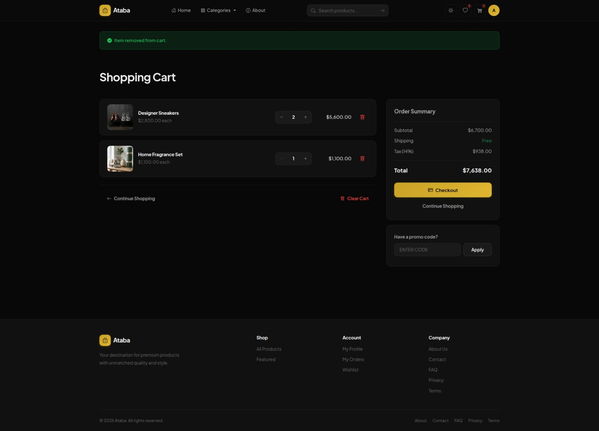
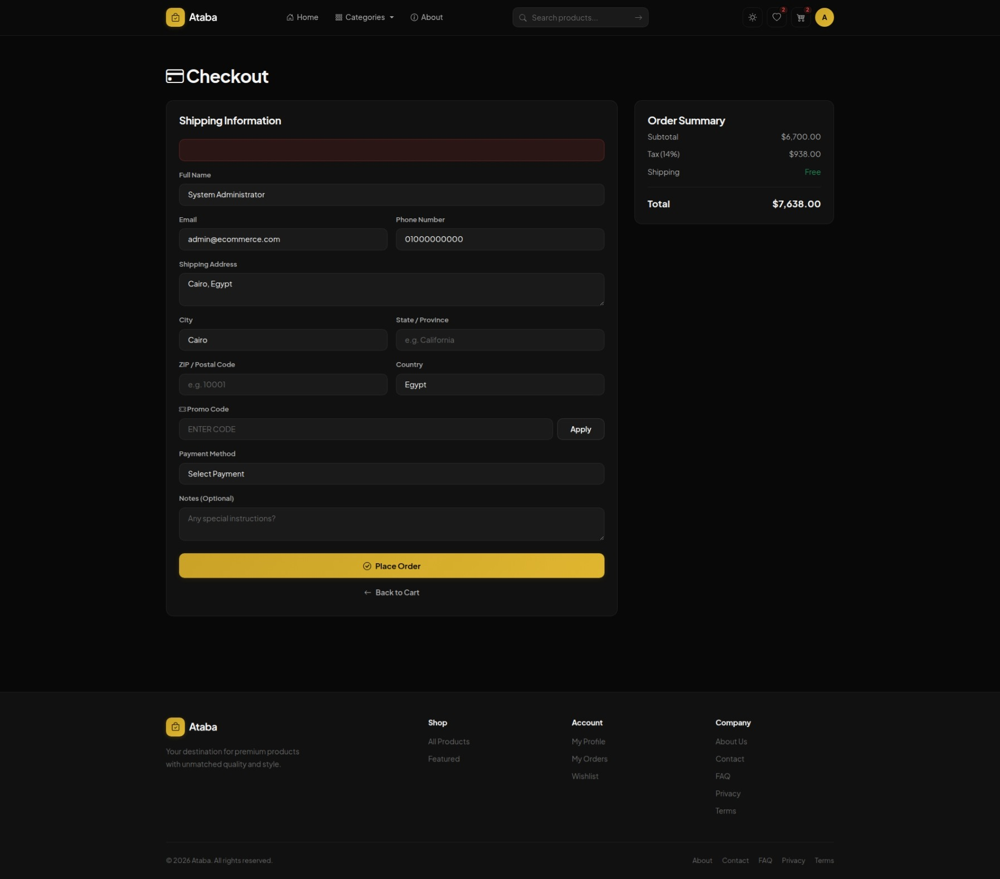
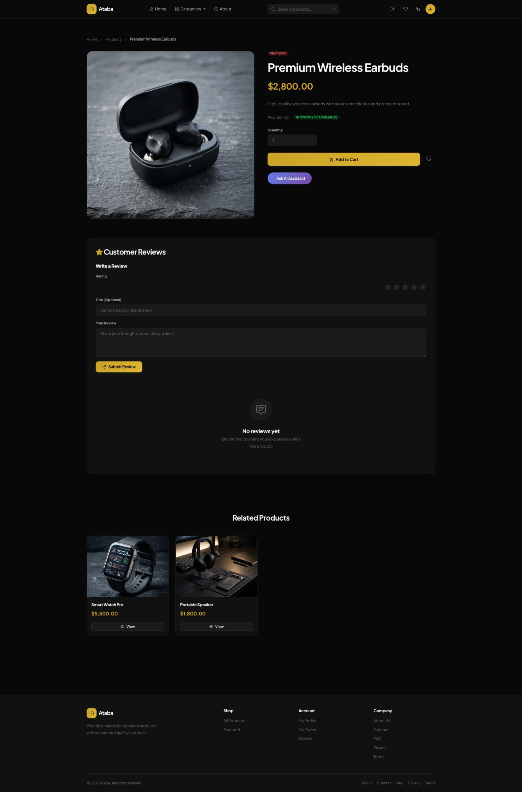

# 3. Web Front-End — MVC Views, CSS, and Client-Side JavaScript

## 3.1 Design Token System (CSS Custom Properties)

The entire visual language is driven by CSS custom properties declared on `:root` and overridden for the light theme via `[data-bs-theme="light"]`. No hardcoded colours exist beyond the token values — every component references these variables, giving us a centralized design system that can be re-themed in one place.

```css
:root {
  /* Backgrounds */
  --bg-primary:   #080808;
  --bg-secondary: #111111;
  --bg-tertiary:  #1a1a1a;
  --bg-elevated:  #222222;
  --bg-hover:     #2a2a2a;

  /* Accent (gold) */
  --accent:       #c9a227;
  --accent-hover: #e0b630;
  --accent-dim:   #a8871f;
  --accent-muted: rgba(201, 162, 39, 0.12);
  --accent-glow:  rgba(201, 162, 39, 0.20);

  /* Text */
  --text-primary:   #f5f5f5;
  --text-secondary: #a8a8a8;
  --text-muted:     #666666;

  /* Semantic */
  --success: #22c55e;
  --danger:  #ef4444;
  --warning: #f59e0b;
  --info:    #38bdf8;

  /* Borders */
  --border-subtle: rgba(255, 255, 255, 0.06);
  --border-light:  rgba(255, 255, 255, 0.11);
  --border-medium: rgba(255, 255, 255, 0.18);

  /* Shadows */
  --shadow-sm:   0 2px 6px  rgba(0,0,0,0.35);
  --shadow-md:   0 4px 14px rgba(0,0,0,0.40);
  --shadow-lg:   0 8px 28px rgba(0,0,0,0.50);
  --shadow-lg:   0 8px 28px rgba(0,0,0,0.50);
  --shadow-glow: 0 0 24px rgba(201, 162, 39, 0.18);

  /* Glass */
  --glass-bg:     rgba(10, 10, 10, 0.88);
  --glass-border: rgba(255, 255, 255, 0.07);

  /* Radii */
  --radius-sm:   6px;
  --radius-md:   10px;
  --radius-lg:   14px;
  --radius-xl:   20px;
  --radius-full: 9999px;

  /* Motion */
  --ease-out:    cubic-bezier(0.16, 1, 0.3, 1);
  --ease-spring: cubic-bezier(0.34, 1.56, 0.64, 1);
  --transition:  0.22s var(--ease-out);

  /* Font */
  --font-sans: 'Plus Jakarta Sans', system-ui, -apple-system, sans-serif;
  --header-h: 68px;
}
```

**UI/UX rationale:** A single gold accent (#c9a227) on a near-black background creates a luxury e-commerce feel. All interactive elements share the `--transition` timing function — a custom cubic-bezier (overshoot-free) that feels snappy but not jarring. The glass header uses `backdrop-filter: blur(12px)` with `--glass-bg` for a frosted effect that reveals page content scrolling underneath, giving a modern macOS-inspired depth hierarchy.

## 3.2 Light Theme Override

The same token system switches via attribute selector — every component automatically re-colours:

```css
[data-bs-theme="light"] {
  --bg-primary:    #f7f7f8;
  --bg-secondary:  #ffffff;
  --bg-tertiary:   #f0f0f2;
  --text-primary:  #111111;
  --text-secondary:#4b4b4b;
  --text-muted:    #9a9a9a;
  --border-subtle: rgba(0, 0, 0, 0.06);
  --glass-bg:      rgba(255, 255, 255, 0.92);
  --glass-border:  rgba(0, 0, 0, 0.06);
  /* shadow-opacity reduced for light mode */
  --shadow-md:   0 4px 14px rgba(0,0,0,0.09);
}
```

**FOUC Prevention:** The theme cookie is read server-side in `_Layout.cshtml` and the `data-bs-theme` attribute is set *before* the HTML is streamed:

```cshtml
@{
    var themeCookie = Context.Request.Cookies["theme"];
    var activeTheme = (themeCookie == "light") ? "light" : "dark";
}
<html lang="en" data-bs-theme="@activeTheme">
```

This eliminates the flash of unstyled content that would occur if JavaScript set the theme after page load.

The flowchart below illustrates the detailed logic flow of the FOUC prevention and theme selection process:

```mermaid
%%{init: {'theme': 'dark'}}%%
graph LR
    classDef client fill:#1f77b4,stroke:#0d47a1,stroke-width:2px,color:#fff;
    classDef server fill:#ff7f0e,stroke:#e65100,stroke-width:2px,color:#fff;

    Start[User Visits Ataba]:::client --> Request[Sends HTTP Request + Theme Cookie]:::client
    Request --> ReadCookie["Server reads Context.Request.Cookies['theme']"]:::server
    ReadCookie --> DetermineTheme{"Is Cookie Value 'light'?"}:::server
    DetermineTheme -->|Yes| SetLight["Set html data-bs-theme='light'"]:::server
    DetermineTheme -->|No / Default| SetDark["Set html data-bs-theme='dark'"]:::server
    SetLight --> StreamHTML[Stream HTML to Client]:::server
    SetDark --> StreamHTML
    StreamHTML --> RenderBrowser["Browser renders page using theme variables"]:::client
    RenderBrowser --> FOUCPrevented["No Visual Flash / FOUC Prevented"]:::client
    RenderBrowser --> UserToggle["User clicks Theme Toggle Button"]:::client
    UserToggle --> JSChange["JavaScript switches html data-bs-theme and updates theme Cookie"]:::client
```



## 3.3 Layout Architecture

### 3.3.1 Global Wrapper

`_Layout.cshtml` defines the shell — header, main content area (with TempData alerts), footer, and the global AI Assistant modal. The `<main>` element uses `padding-top: calc(var(--header-h) + var(--space-xl))` to offset the fixed header:

```css
main {
  min-height: calc(100vh - 200px);
  padding-top: calc(var(--header-h) + var(--space-xl));
  padding-bottom: var(--space-2xl);
}
```

### 3.3.2 Glass Header

Fixed-position, full-width, with backdrop blur for the frosted-glass effect:

```css
.header {
  position: fixed;
  top: 0; left: 0; right: 0;
  z-index: 1000;
  background: var(--glass-bg);
  backdrop-filter: blur(12px);
  -webkit-backdrop-filter: blur(12px);
  border-bottom: 1px solid var(--glass-border);
  transition: background-color var(--transition), border-color var(--transition), box-shadow var(--transition);
}
.header.scrolled { box-shadow: var(--shadow-md); }
```

The `.scrolled` class is toggled by JS on scroll > 8px:

```js
(function () {
    const header = document.querySelector('.header');
    if (!header) return;
    const onScroll = () => header.classList.toggle('scrolled', window.scrollY > 8);
    window.addEventListener('scroll', onScroll, { passive: true });
    onScroll();
})();
```

### 3.3.3 Navigation Layout

The header uses flexbox with three zones: logo (left), nav links + search (center), actions (right):

```css
.header-inner {
  display: flex;
  align-items: center;
  justify-content: space-between;
  padding: 14px 0;
  gap: var(--space-lg);
}
```

**Categories Dropdown** — Pure CSS dropdown triggered by hover (`.dropdown:hover .dropdown-menu`):

```css
.dropdown-menu {
  position: absolute;
  top: calc(100% + 10px);
  right: 0;
  background: var(--bg-secondary);
  border: 1px solid var(--border-light);
  border-radius: var(--radius-md);
  box-shadow: var(--shadow-lg);
  padding: var(--space-xs);
  min-width: 200px;
  z-index: 1001;
  opacity: 0;
  visibility: hidden;
  transform: translate3d(0, -10px, 0);
  transition: opacity var(--transition), transform var(--transition), visibility 0.22s;
}
.dropdown:hover .dropdown-menu { /* open state */ }
```

Categories are cached server-side with `IMemoryCache` (5-minute absolute, 2-minute sliding) and rendered in both desktop dropdown and mobile nav:

```cshtml
@inject IMemoryCache MemoryCache
@inject IUnitOfWork UnitOfWork
@{
    var navCategories = await MemoryCache.GetOrCreateAsync("NavCategories", async entry =>
    {
        entry.AbsoluteExpirationRelativeToNow = TimeSpan.FromMinutes(5);
        entry.SlidingExpiration = TimeSpan.FromMinutes(2);
        return (await UnitOfWork.Categories.GetAsync(c => c.IsActive)).ToList();
    });
}
```

### 3.3.4 Search Bar

The search bar is a form that GET-submits to `ProductsController.Index`. It uses a pill-shaped input with an absolutely-positioned search icon and arrow button:

```html
<form asp-controller="Products" asp-action="Index" method="get" class="nav-search d-none d-lg-flex">
    <div class="search-wrapper">
        <i class="bi bi-search search-icon"></i>
        <input type="text" name="searchTerm" class="form-control search-input"
               placeholder="Search products..." value="@Context.Request.Query["searchTerm"]">
        <button type="submit" class="search-btn" aria-label="Search">
            <i class="bi bi-arrow-right"></i>
        </button>
    </div>
</form>
```

```css
.search-input {
  padding: 0 38px 0 36px !important;
  height: 38px;
  font-size: 0.85rem;
  background: var(--bg-tertiary);
  border: 1px solid var(--border-subtle);
  border-radius: var(--radius-full);
  color: var(--text-primary);
  line-height: 38px;
  transition: border-color var(--transition), box-shadow var(--transition), background-color var(--transition);
}
.search-input:focus {
  outline: none;
  border-color: var(--accent);
  box-shadow: 0 0 0 3px var(--accent-muted);
  background: var(--bg-secondary);
}
```

### 3.3.5 Mobile Menu

Button toggles `.show` on the `.mobile-nav` element. Uses `max-height` animation for the expand/collapse (choreographed with opacity and visibility):

```css
.mobile-nav {
  max-height: 0;
  opacity: 0;
  overflow: hidden;
  visibility: hidden;
  transition: max-height 0.38s var(--ease-out), opacity 0.25s var(--ease-out), visibility 0s 0.38s;
  border-top: 1px solid var(--border-subtle);
}
.mobile-nav.show {
  max-height: 520px;
  opacity: 1;
  visibility: visible;
  transition: max-height 0.38s var(--ease-out), opacity 0.25s var(--ease-out), visibility 0s;
}
```

The toggle JS swaps the hamburger/close icon:

```js
function toggleMobileMenu() {
    const nav = document.getElementById('mobile-nav');
    const btn = document.getElementById('mobile-menu-btn');
    const isOpen = nav.classList.toggle('show');
    const icon = btn.querySelector('i');
    icon.className = isOpen ? 'bi bi-x' : 'bi bi-list';
    btn.setAttribute('aria-expanded', isOpen);
}
```

### 3.3.6 Footer

Four-column CSS grid with `2fr repeat(3, 1fr)` — brand description spans 2 fractions, then three link columns. Collapses to 2 columns at 1024px, single column at 480px:

```css
.footer-grid {
  display: grid;
  grid-template-columns: 2fr repeat(3, 1fr);
  gap: var(--space-2xl);
  margin-bottom: var(--space-2xl);
}
@media (max-width: 1024px) { .footer-grid { grid-template-columns: repeat(2, 1fr); } }
@media (max-width: 768px) {
  .footer-grid { grid-template-columns: 1fr 1fr; }
  .footer-brand { grid-column: 1 / -1; }
  .footer-bottom { flex-direction: column; text-align: center; }
}
@media (max-width: 480px) { .footer-grid { grid-template-columns: 1fr; } }
```

## 3.4 Home Page (`Views/Home/Index.cshtml`)

### 3.4.1 Hero Section

Two-column grid (text | visual ring) that collapses to single column on mobile. The background uses layered radial gradients and a dot-grid overlay (pseudo-elements) for a subtle tech-luxury texture:

```css
.hero-background {
  position: absolute;
  inset: 0;
  background: linear-gradient(150deg, var(--bg-primary) 0%, var(--bg-secondary) 55%, var(--bg-tertiary) 100%);
  z-index: -1;
}
.hero-background::before {
  content: '';
  position: absolute;
  inset: 0;
  background:
    radial-gradient(ellipse 80% 60% at 20% 60%, rgba(201, 162, 39, 0.10) 0%, transparent 60%),
    radial-gradient(ellipse 50% 40% at 80% 30%, rgba(201, 162, 39, 0.06) 0%, transparent 50%);
}
.hero-background::after {
  content: '';
  position: absolute;
  inset: 0;
  background-image: radial-gradient(circle 1px at center, rgba(201,162,39,0.18) 1px, transparent 0);
  background-size: 48px 48px;
  opacity: 0.25;
}
```

The visual ring uses `pulse-glow` animation and a radial gradient to create a glowing orb:

```css
.hero-visual-ring {
  width: clamp(200px, 22vw, 300px);
  height: clamp(200px, 22vw, 300px);
  border-radius: 50%;
  background: radial-gradient(circle, var(--accent-muted) 0%, transparent 70%);
  border: 1px solid rgba(201, 162, 39, 0.2);
  animation: pulse-glow 4s ease-in-out infinite;
}
```

The hero heading uses `clamp()` for fluid typography and a gradient text fill:

```css
.hero h1 {
  font-size: clamp(2.5rem, 5vw, 3.75rem);
  font-weight: 800;
  line-height: 1.08;
  background: linear-gradient(135deg, var(--text-primary) 0%, var(--text-secondary) 100%);
  -webkit-background-clip: text;
  -webkit-text-fill-color: transparent;
  background-clip: text;
}
```

### 3.4.2 Feature Cards

Three-column grid of cards with icon, title, and description. The icon container uses `--accent-muted` background that transitions to full `--accent` on hover:

```html
<div class="feature-card animate-fade-in-up stagger-1">
    <div class="feature-card-icon">
        <i class="bi bi-truck" aria-hidden="true"></i>
    </div>
    <h5>Free Shipping</h5>
    <p>On orders over $50</p>
</div>
```

```css
.feature-card-icon {
  width: 56px; height: 56px;
  display: flex; align-items: center; justify-content: center;
  margin: 0 auto var(--space-md);
  background: var(--accent-muted);
  border-radius: var(--radius-lg);
  font-size: 1.5rem;
  color: var(--accent);
  transition: background-color var(--transition), transform var(--transition);
}
.feature-card:hover .feature-card-icon {
  background: var(--accent);
  color: #000;
  transform: scale(1.06);
}
```

### 3.4.3 Category Grid

Uses `grid-auto-200` (auto-fill with 160px minimum) with a cycled icon set:

```html
@{
    string[] catIcons = { "bi-bag-heart", "bi-headphones", "bi-shoe", "bi-lamp", "bi-controller", "bi-camera" };
}
...
@for (int i = 0; i < Math.Min(categories.Count, 6); i++)
{
    var icon = catIcons[i % catIcons.Length];
    <a asp-controller="Products" asp-action="ByCategory" asp-route-id="@categories[i].Id"
       class="category-card animate-fade-in-up stagger-@(i + 1)"
       aria-label="Browse @categories[i].Name products">
        <div class="category-card-icon">
            <i class="bi @icon" aria-hidden="true"></i>
        </div>
        <span>@categories[i].Name</span>
    </a>
}
```

### 3.4.4 Featured Products Grid

Renders `product-card` articles in an `auto-fill` grid. Each card includes an AI assistant button that opens the global modal via `openAIModal()`:

```html
<button class="ai-card-btn"
        onclick="event.preventDefault(); openAIModal('@Html.Raw(product.Name.Replace("'", "\\'"))', '@Html.Raw(product.Description?.Replace("'", "\\'").Replace("\n", " ").Replace("\r", ""))')"
        title="Ask AI about this product"
        aria-label="Ask AI about @product.Name">
    <i class="bi bi-sparkles"></i>
</button>
```

The `Replace("'", "\\'")` calls escape single quotes to prevent JS injection from product names containing apostrophes.

### 3.4.5 Newsletter Section

Gold gradient card with a CTA form:

```css
.newsletter-card {
  background: linear-gradient(135deg, var(--accent) 0%, #9e7d1a 100%);
  border-radius: var(--radius-xl);
  position: relative;
}
.newsletter-card::before {
  content: '';
  position: absolute;
  inset: 0;
  background:
    radial-gradient(ellipse 60% 80% at 80% 50%, rgba(255,255,255,0.08) 0%, transparent 60%),
    radial-gradient(ellipse 40% 60% at 10% 20%, rgba(255,255,255,0.05) 0%, transparent 50%);
  pointer-events: none;
}
```

## 3.5 Product Listing Page (`Views/Products/Index.cshtml`)

### 3.5.1 Filter Form

A card containing a horizontal filter form with search, category dropdown, price range (min/max), sort order, and action buttons:

```html
<form asp-action="Index" method="get" class="filter-form" id="filterForm">
    <input type="hidden" name="page" id="pageInput" value="1" />

    <div class="form-group filter-search">
        <label class="form-label" for="searchInput">Search</label>
        <input type="text" id="searchInput" name="searchTerm" class="form-control"
               placeholder="Search products…" value="@searchTerm">
    </div>

    <div class="form-group filter-min-width">
        <label class="form-label" for="categorySelect">Category</label>
        <select id="categorySelect" name="categoryId" class="form-select">
            <option value="">All Categories</option>
            @foreach (var category in categories)
            {
                <option value="@category.Id" selected="@(selectedCategoryId == category.Id)">
                    @category.Name
                </option>
            }
        </select>
    </div>

    <div class="form-group">
        <label class="form-label">Price Range</label>
        <div class="filter-group-flex">
            <input type="number" name="minPrice" class="form-control" placeholder="Min" value="@minPrice" step="0.01" min="0">
            <input type="number" name="maxPrice" class="form-control" placeholder="Max" value="@maxPrice" step="0.01" min="0">
        </div>
    </div>

    <div class="form-group filter-min-width-sm">
        <label class="form-label" for="sortSelect">Sort By</label>
        <select id="sortSelect" name="sortBy" class="form-select">
            <option value="newest" selected="@(sortBy == "newest" || sortBy == null)">Newest</option>
            <option value="price_asc" selected="@(sortBy == "price_asc")">Price: Low to High</option>
            <option value="price_desc" selected="@(sortBy == "price_desc")">Price: High to Low</option>
            <option value="name_asc" selected="@(sortBy == "name_asc")">Name: A to Z</option>
            <option value="name_desc" selected="@(sortBy == "name_desc")">Name: Z to A</option>
        </select>
    </div>

    <div class="form-group flex gap-sm items-center">
        <button type="submit" class="btn btn-primary"><i class="bi bi-funnel" aria-hidden="true"></i> Filter</button>
        <a asp-action="Index" class="btn btn-ghost"><i class="bi bi-x" aria-hidden="true"></i> Clear</a>
    </div>
</form>
```

### 3.5.2 AJAX Filtering & Pagination

The product grid is loaded asynchronously via `fetch()` to `/Products/Filter`. The JavaScript collects form data, builds query params, and fetches a partial HTML replacement. On success, it updates the container's innerHTML and pushes the new URL to `history.replaceState` for proper browser back-button support.

The flowchart below traces the complete AJAX request/response lifecycle:


```js
async function loadProducts() {
    const container = document.getElementById('productGridContainer');
    const overlay = document.getElementById('loadingOverlay');
    overlay.style.display = 'flex';

    try {
        const params = getFilterParams();
        const response = await fetch('@Url.Action("Filter", "Products")?' + params, {
            headers: { 'X-Requested-With': 'XMLHttpRequest' }
        });
        const html = await response.text();
        container.innerHTML = html;
        history.replaceState(null, '', '@Url.Action("Index", "Products")?' + params);
    } catch {
        container.innerHTML = '<div class="empty-state">...</div>';
    } finally {
        overlay.style.display = 'none';
    }
}
```

Debounced inputs (400ms for search, 300ms for category/price/sort) reduce server load:

```js
function debouncedLoad() {
    clearTimeout(debounceTimer);
    debounceTimer = setTimeout(() => {
        currentPage = 1;
        loadProducts();
    }, 300);
}
document.getElementById('categorySelect').addEventListener('change', debouncedLoad);
document.querySelectorAll('input[name="minPrice"], input[name="maxPrice"]').forEach(input => {
    input.addEventListener('input', debouncedLoad);
});
document.getElementById('searchInput').addEventListener('input', function () {
    clearTimeout(debounceTimer);
    debounceTimer = setTimeout(() => { currentPage = 1; loadProducts(); }, 400);
});
```

**Loading state overlay:**
```html
<div id="loadingOverlay" class="loading-overlay" style="display:none;">
    <div class="spinner-border text-primary" role="status">
        <span class="visually-hidden">Loading...</span>
    </div>
</div>
```

### 3.5.3 Product Grid Partial (`_ProductGrid.cshtml`)

This partial receives a `PaginatedList<Product>` and renders either the product grid with paginated navigation or an empty state:

```html
@model PaginatedList<Product>

@if (Model.Items.Any())
{
    <div class="grid grid-auto-fill product-grid">
        @foreach (var product in Model.Items)
        {
            <article class="product-card">
                <div class="image-wrapper">
                    <div class="badge-wrapper">
                        @if (product.IsFeatured) { <span class="badge badge-danger">Featured</span> }
                    </div>
                    <a asp-action="Details" asp-route-id="@product.Id">
                        
                    </a>
                    <button class="icon-btn icon-btn-card"
                            onclick="event.preventDefault(); toggleWishlist(@product.Id, this)"
                            aria-label="Toggle wishlist for @product.Name">
                        <i class="bi bi-heart"></i>
                    </button>
                    <button class="ai-card-btn"
                            onclick="event.preventDefault(); openAIModal('...')" ...>
                        <i class="bi bi-sparkles"></i>
                    </button>
                </div>
                <div class="card-content">
                    <h3 class="product-title">
                        <a asp-action="Details" asp-route-id="@product.Id" class="product-title-link">@product.Name</a>
                    </h3>
                    <p class="product-desc">@(product.Description?.Length > 65 ? product.Description[..65] + "…" : product.Description)</p>
                    <div class="price-stock-row">
                        <span class="product-price">@product.Price.ToString("C")</span>
                        <span class="badge @(product.Stock > 0 ? "badge-success" : "badge-danger")">
                            @(product.Stock > 0 ? "In Stock" : "Sold Out")
                        </span>
                    </div>
                </div>
                <div class="card-actions">
                    <a asp-action="Details" asp-route-id="@product.Id" class="btn btn-secondary btn-sm flex-fill">
                        <i class="bi bi-eye"></i> View
                    </a>
                </div>
            </article>
        }
    </div>

    <!-- Pagination -->
    <div class="flex items-center justify-between flex-wrap gap-md mt-5">
        <p class="page-info">Showing @((Model.PageIndex - 1) * 12 + 1)–@Math.Min(Model.PageIndex * 12, Model.TotalCount) of @Model.TotalCount</p>
        @if (Model.TotalPages > 1)
        {
            <nav class="pagination" aria-label="Product pages">
                <button class="page-link @(Model.HasPreviousPage ? "" : "disabled")"
                        onclick="loadPage(@(Model.PageIndex - 1))" ...>
                    <i class="bi bi-chevron-left"></i>
                </button>
                @* Smart ellipsis: show first page, last page, and pages around current index *@
                @{
                    var startPage = Math.Max(1, Model.PageIndex - 2);
                    var endPage   = Math.Min(Model.TotalPages, Model.PageIndex + 2);
                    if (startPage > 1) {
                        <button class="page-link" onclick="loadPage(1)">1</button>
                        if (startPage > 2) { <span class="page-link disabled" aria-hidden="true">…</span> }
                    }
                    for (int i = startPage; i <= endPage; i++) {
                        <button class="page-link @(i == Model.PageIndex ? "active" : "")"
                                onclick="loadPage(@i)" @(i == Model.PageIndex ? "aria-current='page'" : "")>@i</button>
                    }
                    if (endPage < Model.TotalPages) {
                        if (endPage < Model.TotalPages - 1) { <span class="page-link disabled" aria-hidden="true">…</span> }
                        <button class="page-link" onclick="loadPage(@Model.TotalPages)">@Model.TotalPages</button>
                    }
                }
                <button class="page-link @(Model.HasNextPage ? "" : "disabled")"
                        onclick="loadPage(@(Model.PageIndex + 1))" ...>
                    <i class="bi bi-chevron-right"></i>
                </button>
            </nav>
        }
    </div>
}
else
{
    <div class="empty-state">
        <div class="empty-state-icon"><i class="bi bi-inbox"></i></div>
        <h4>No products found</h4>
        <p>Try adjusting your search or filter criteria</p>
        <a asp-action="Index" class="btn btn-primary">Clear All Filters</a>
    </div>
}
```

**Empty state** — centered container with large icon, message, and a CTA button. Used consistently across products, cart, wishlist, orders, and reviews:

```css
.empty-state {
  display: flex; flex-direction: column;
  align-items: center; justify-content: center;
  padding: var(--space-4xl) var(--space-xl);
  text-align: center;
}
.empty-state-icon {
  width: 80px; height: 80px;
  display: flex; align-items: center; justify-content: center;
  background: var(--bg-tertiary); border-radius: 50%;
  margin: 0 auto var(--space-lg);
  font-size: 2.25rem; color: var(--text-muted);
}
```

### 3.5.4 Product Card Component Breakdown

The `.product-card` is a self-contained compound component with:

| Element | Class | Purpose |
|---------|-------|---------|
| Image wrapper | `.image-wrapper` | Fixed `aspect-ratio: 4/3`, overflow hidden for zoom |
| Badge wrapper | `.badge-wrapper` | Absolute top-left, z-index 2 |
| Product image | — | `object-fit: cover`, `hover: scale(1.07)` |
| Wishlist button | `.icon-btn.icon-btn-card` | Glass-background button, absolute top-right |
| AI button | `.ai-card-btn` | Appears on hover, absolute bottom-right |
| Card content | `.card-content` | Flex column with title, description, price/stock |
| Actions | `.card-actions` | Bottom button strip |

```css
.product-card {
  background: var(--bg-secondary);
  border: 1px solid var(--border-subtle);
  border-radius: var(--radius-lg);
  overflow: hidden;
  transition: transform var(--transition), border-color var(--transition), box-shadow var(--transition);
  display: flex;
  flex-direction: column;
  height: 100%;
}
.product-card:hover {
  transform: translate3d(0, -5px, 0);
  border-color: var(--accent);
  box-shadow: var(--shadow-lg), 0 0 0 1px var(--accent-muted);
}
.product-card img {
  width: 100%; height: 100%;
  object-fit: cover;
  transition: transform 0.4s var(--ease-out);
}
.product-card:hover img { transform: scale(1.07); }

.product-title {
  display: -webkit-box;
  -webkit-line-clamp: 2;
  -webkit-box-orient: vertical;
  overflow: hidden;
}
.product-desc {
  display: -webkit-box;
  -webkit-line-clamp: 2;
  -webkit-box-orient: vertical;
  overflow: hidden;
}
```

**AI button hover reveal:**
```css
.ai-card-btn {
  position: absolute;
  bottom: var(--space-sm);
  right: var(--space-sm);
  width: 34px; height: 34px;
  opacity: 0;
  transform: scale(0.85);
  transition: opacity var(--transition), transform var(--transition);
}
.product-card:hover .ai-card-btn {
  opacity: 1;
  transform: scale(1);
}
@media (hover: none) { .ai-card-btn { opacity: 1; transform: scale(1); } }
```

The hover media query fallback ensures AI buttons are visible on touch devices where hover is not available.

## 3.6 Cart Page (`Views/Cart/Index.cshtml`)

The designed shopping cart interface offers users clear summaries of selected items, quantity manipulation, and real-time calculation of taxes (14% VAT) and shipping costs, as shown in the screenshot below:



### 3.6.1 Cart Layout

Two-column grid (items list + summary sidebar). The summary uses `position: sticky` with `top: calc(var(--header-h) + var(--space-md))` to follow the user as they scroll:

```css
.cart-layout {
  display: grid;
  grid-template-columns: 1fr 360px;
  gap: var(--space-xl);
  align-items: start;
}
.cart-summary {
  position: sticky;
  top: calc(var(--header-h) + var(--space-md));
}
@media (max-width: 1000px) {
  .cart-layout { grid-template-columns: 1fr; }
  .cart-summary { position: static; }
}
```

### 3.6.2 Cart Item Component

Each item is a horizontal flex row with image thumbnail, details (title, variant meta, price), quantity stepper, line total, and remove button:

```html
<div class="cart-item">
    <div class="cart-item-image">
        <a asp-controller="Products" asp-action="Details" asp-route-id="@item.Product.Id">
            
        </a>
    </div>
    <div class="cart-item-details">
        <h5 class="cart-item-title"><a ...>@item.Product.Name</a></h5>
        @if (item.Cart.ProductVariant != null)
        {
            <p class="cart-item-meta">@v.Size / @v.Color</p>
        }
        <p class="cart-item-price">@item.Product.Price.ToString("C") each</p>
    </div>
    <div class="quantity-input">
        <form asp-action="UpdateQuantity" method="post" class="d-inline">
            <input type="hidden" name="cartId" value="@item.Cart.Id" />
            <input type="hidden" name="quantity" value="@(item.Cart.Quantity - 1)" />
            <button type="submit" class="quantity-btn" @(item.Cart.Quantity <= 1 ? "disabled" : "")>
                <i class="bi bi-dash"></i>
            </button>
        </form>
        <span class="quantity-value">@item.Cart.Quantity</span>
        <form asp-action="UpdateQuantity" method="post" class="d-inline">
            <input type="hidden" name="cartId" value="@item.Cart.Id" />
            <input type="hidden" name="quantity" value="@(item.Cart.Quantity + 1)" />
            <button type="submit" class="quantity-btn" @(item.Cart.Quantity >= item.Product.Stock ? "disabled" : "")>
                <i class="bi bi-plus"></i>
            </button>
        </form>
    </div>
    <div class="cart-item-total">
        <span class="product-price">@((item.Product.Price * item.Cart.Quantity).ToString("C"))</span>
    </div>
    <form asp-action="RemoveItem" method="post">
        <input type="hidden" name="cartId" value="@item.Cart.Id" />
        <button type="submit" class="icon-btn btn-text-danger" onclick="return confirm('Remove this item from your cart?')">
            <i class="bi bi-trash"></i>
        </button>
    </form>
</div>
```

**Quantity stepper styling:**
```css
.quantity-input {
  display: flex;
  align-items: center;
  gap: 2px;
  background: var(--bg-tertiary);
  border: 1px solid var(--border-subtle);
  border-radius: var(--radius-md);
  padding: 3px;
}
.quantity-btn {
  width: 32px; height: 32px;
  display: flex; align-items: center; justify-content: center;
  background: transparent; border: none;
  color: var(--text-secondary);
  cursor: pointer;
  border-radius: var(--radius-sm);
  transition: background-color var(--transition), color var(--transition);
}
.quantity-btn:hover { background: var(--accent-muted); color: var(--accent); }
.quantity-btn:disabled { opacity: 0.3; cursor: not-allowed; pointer-events: none; }
.quantity-value {
  width: 40px; text-align: center;
  font-weight: 700; font-size: 0.9rem;
  color: var(--text-primary);
}
```

### 3.6.3 Summary Sidebar

```html
<div class="cart-summary">
    <h5 class="cart-summary-title">Order Summary</h5>
    <div class="cart-summary-row">
        <span>Subtotal</span> <span>@total.ToString("C")</span>
    </div>
    <div class="cart-summary-row">
        <span>Tax (14%)</span> <span>@tax.ToString("C")</span>
    </div>
    <div class="cart-summary-row">
        <span>Shipping</span> <span class="text-success">Free</span>
    </div>
    <div class="cart-summary-row total">
        <span>Total</span> <span>@grand.ToString("C")</span>
    </div>
    <div class="cart-actions">
        <a asp-controller="Checkout" asp-action="Index" class="btn btn-primary w-100">
            <i class="bi bi-lock"></i> Proceed to Checkout
        </a>
    </div>
</div>
```

## 3.7 Checkout Page (`Views/Checkout/Index.cshtml`)

The checkout page provides the final stage of purchase where shipping information is gathered, promotional coupon codes can be applied via AJAX, and the payment method (COD or Stripe) is selected, as illustrated below:



Two-column layout: shipping form (left) + order summary (right, sticky). The form uses ASP.NET Core tag helpers for model binding and client-side validation:

```html
<form asp-action="PlaceOrder" method="post">
    <div asp-validation-summary="All" class="alert alert-danger"></div>

    <div class="form-group">
        <label asp-for="FullName" class="form-label"></label>
        <input asp-for="FullName" class="form-control">
        <span asp-validation-for="FullName" class="text-danger"></span>
    </div>

    <div class="grid grid-2" style="gap: 1rem;">
        <div class="form-group">
            <label asp-for="Email" class="form-label"></label>
            <input asp-for="Email" class="form-control" type="email">
            <span asp-validation-for="Email" class="text-danger"></span>
        </div>
        <div class="form-group">
            <label asp-for="PhoneNumber" class="form-label"></label>
            <input asp-for="PhoneNumber" class="form-control">
            <span asp-validation-for="PhoneNumber" class="text-danger"></span>
        </div>
    </div>

    <div class="form-group">
        <label asp-for="Address" class="form-label"></label>
        <textarea asp-for="Address" class="form-control" rows="2"></textarea>
        <span asp-validation-for="Address" class="text-danger"></span>
    </div>
    <!-- City, State, Zip, Country in 2-column grids -->
    ...
    <!-- Payment method selector -->
    <div class="form-group">
        <label asp-for="PaymentMethod" class="form-label"></label>
        <select asp-for="PaymentMethod" class="form-select" required>
            <option value="">Select Payment</option>
            <option value="1">Cash on Delivery</option>
            <option value="2">Credit Card (Stripe)</option>
        </select>
    </div>
    ...
</form>
```

**Promo code validation** — AJAX call to `CheckoutController.ValidatePromoCode`:

```js
document.getElementById('applyPromoBtn').addEventListener('click', async function () {
    const code = document.getElementById('promoCodeInput').value.trim();
    const orderTotal = originalTotal - currentDiscount;

    const response = await fetch('@Url.Action("ValidatePromoCode", "Checkout")', {
        method: 'POST',
        headers: {
            'Content-Type': 'application/json',
            'RequestVerificationToken': document.querySelector('input[name="__RequestVerificationToken"]')?.value
        },
        body: JSON.stringify({ code: code, orderTotal: orderTotal })
    });
    const data = await response.json();

    if (data.success) {
        currentDiscount = data.discountAmount;
        document.getElementById('discountRow').style.display = 'flex';
        document.getElementById('discountAmount').textContent = '-' + data.discountAmount.toFixed(2);
        document.getElementById('totalAmount').textContent = data.newTotal.toFixed(2);
    } else {
        messageDiv.innerHTML = '<span class="text-danger">...</span>';
    }
});
```

The promo code input auto-uppercases and resets the discount display when the user modifies the field:

```js
document.querySelector('input[name="PromoCode"]').addEventListener('input', function () {
    this.value = this.value.toUpperCase();
    resetDiscount();
});
```

## 3.8 AI Assistant Modal

### 3.8.1 Modal Structure

Defined globally in `_Layout.cshtml` — openable from any product card. Uses a `fixed` overlay with backdrop blur and a centered modal card with spring animation:

```html
<div class="ai-modal-overlay" id="aiModal" onclick="if(event.target === this) closeAIModal()">
    <div class="ai-modal" onclick="event.stopPropagation()">
        <div class="ai-modal-header">
            <div class="ai-modal-title">
                <i class="bi bi-sparkles"></i> AI Product Assistant
            </div>
            <button class="ai-modal-close" onclick="closeAIModal()"><i class="bi bi-x"></i></button>
        </div>
        <div class="ai-modal-body" id="aiResponse">
            <div class="ai-placeholder">
                <i class="bi bi-chat-dots"></i>
                <p>Ask me anything about products!</p>
            </div>
        </div>
        <div class="ai-modal-footer">
            <input type="text" class="form-control" id="aiQuestion"
                   placeholder="e.g., What are the best features?"
                   onkeydown="if(event.key==='Enter') askAI()">
            <button class="btn btn-primary" onclick="askAI()" id="aiAskBtn">
                <i class="bi bi-send"></i>
            </button>
        </div>
    </div>
</div>
```

### 3.8.2 Modal CSS

Overlay transition with spring for the modal card:

```css
.ai-modal-overlay {
  position: fixed; inset: 0;
  background: rgba(0,0,0,0.65);
  backdrop-filter: blur(6px);
  z-index: 9999;
  display: flex; align-items: center; justify-content: center;
  padding: var(--space-lg);
  opacity: 0; visibility: hidden;
  transition: opacity 0.3s var(--ease-out), visibility 0.3s;
}
.ai-modal-overlay.show { opacity: 1; visibility: visible; }

.ai-modal {
  width: 100%; max-width: 500px;
  background: var(--bg-secondary);
  border: 1px solid var(--border-subtle);
  border-radius: var(--radius-xl);
  overflow: hidden;
  transform: scale(0.94) translate3d(0, 22px, 0);
  transition: transform 0.3s var(--ease-spring);
  box-shadow: var(--shadow-xl);
}
.ai-modal-overlay.show .ai-modal {
  transform: scale(1) translate3d(0, 0, 0);
}
```

### 3.8.3 AI Fetch Logic

```js
let currentProductName = '';
let currentProductDescription = '';
let aiRequestInProgress = false;

function openAIModal(productName, productDescription) {
    currentProductName = productName || '';
    currentProductDescription = productDescription || '';
    const modal = document.getElementById('aiModal');
    if (modal) {
        modal.classList.add('show');
        document.getElementById('aiQuestion')?.focus();
    }
}

function closeAIModal() { /* remove .show, reset content */ }

function askAI() {
    if (aiRequestInProgress) return;
    const question = document.getElementById('aiQuestion')?.value.trim();
    if (!question) return;

    aiRequestInProgress = true;
    const btn = document.getElementById('aiAskBtn');
    const responseDiv = document.getElementById('aiResponse');

    btn.disabled = true;
    btn.innerHTML = '<span class="ai-spinner"></span>';
    responseDiv.innerHTML = '<div class="ai-loading"><div class="ai-spinner-large"></div><p>Thinking...</p></div>';

    fetch('/api/AIAssistant/ask', {
        method: 'POST',
        headers: { 'Content-Type': 'application/json' },
        body: JSON.stringify({
            productName: currentProductName,
            productDescription: currentProductDescription,
            question: question
        })
    })
    .then(async res => {
        const data = await res.json();
        if (res.ok && data.success) {
            responseDiv.innerHTML = `<div class="ai-response-text">${escapeHtml(data.response)}</div>`;
        } else {
            responseDiv.innerHTML = `<div class="ai-error"><i class="bi bi-exclamation-triangle"></i>${escapeHtml(data.message || 'Something went wrong')}</div>`;
        }
    })
    .catch(() => {
        responseDiv.innerHTML = '<div class="ai-error"><i class="bi bi-wifi-off"></i>Network error. Please try again.</div>';
    })
    .finally(() => {
        btn.disabled = false;
        btn.innerHTML = '<i class="bi bi-send"></i>';
        aiRequestInProgress = false;
    });
}

// XSS prevention
function escapeHtml(text) {
    const div = document.createElement('div');
    div.textContent = text;
    return div.innerHTML;
}

// Close on Escape
document.addEventListener('keydown', function(e) {
    if (e.key === 'Escape') closeAIModal();
});
```

**States handled:** loading (spinner with "Thinking..."), success (response text), error (server error or network failure), and empty (placeholder). The `escapeHtml` function prevents XSS from AI-generated responses that might contain HTML.

## 3.9 Theme Toggle JavaScript

Inlined in `_Layout.cshtml` to execute immediately without waiting for external script loads:

```js
function setThemeCookie(theme) {
    const maxAge = 365 * 24 * 60 * 60;
    document.cookie = `theme=${theme};max-age=${maxAge};path=/;SameSite=Lax`;
}

function toggleTheme() {
    const html     = document.documentElement;
    const newTheme = html.getAttribute('data-bs-theme') === 'dark' ? 'light' : 'dark';
    html.setAttribute('data-bs-theme', newTheme);
    setThemeCookie(newTheme);
    updateThemeIcon(newTheme);
}

function updateThemeIcon(theme) {
    const btn = document.getElementById('themeToggleBtn');
    if (!btn) return;
    const icon = btn.querySelector('i');
    if (icon) icon.className = theme === 'dark' ? 'bi bi-sun' : 'bi bi-moon-stars';
}
```

The cookie uses `SameSite=Lax` (default-compatible with most browsers) and a 1-year expiry for persistence across sessions.

## 3.10 Toast Notification System (`wwwroot/js/site.js`)

A programmatic toast system that lazy-creates a container and auto-dismisses after 4.2 seconds with a slide-out animation:

```js
let toastIdCounter = 0;

function showToast(message, type = 'success') {
    let container = document.getElementById('toast-container-global');
    if (!container) {
        container = document.createElement('div');
        container.id = 'toast-container-global';
        container.className = 'toast-container';
        document.body.appendChild(container);
    }

    const id = ++toastIdCounter;
    const toast = document.createElement('div');
    toast.className = `toast-notification toast-${type}`;
    toast.id = 'toast-' + id;
    toast.setAttribute('role', 'alert');
    toast.setAttribute('aria-live', 'assertive');
    toast.innerHTML = `<span>${message}</span><button class="toast-close" onclick="dismissToast(${id})" aria-label="Dismiss">&times;</button>`;
    container.appendChild(toast);
    setTimeout(() => dismissToast(id), 4200);
}

function dismissToast(id) {
    const el = document.getElementById('toast-' + id);
    if (el) {
        el.classList.add('toast-dismissing');
        setTimeout(() => el.remove(), 320);
    }
}
```

**CSS:**
```css
.toast-container {
  position: fixed;
  top: calc(var(--header-h) + var(--space-md));
  right: var(--space-lg);
  z-index: 99999;
  display: flex;
  flex-direction: column;
  gap: 10px;
  pointer-events: none;
}
.toast-notification {
  padding: 12px var(--space-md);
  background: var(--bg-secondary);
  border: 1px solid var(--border-light);
  border-radius: var(--radius-md);
  box-shadow: var(--shadow-lg);
  font-size: 0.9rem; font-weight: 600;
  display: flex; align-items: center; gap: var(--space-sm);
  max-width: 360px;
  pointer-events: auto;
  animation: slideInRight 0.35s var(--ease-out);
  transition: opacity 0.3s var(--ease-out), transform 0.3s var(--ease-out);
}
.toast-notification.toast-dismissing { opacity: 0; transform: translateX(110%); }
.toast-success { border-left: 3px solid var(--success); color: var(--success); }
.toast-error   { border-left: 3px solid var(--danger);  color: var(--danger);  }
```

The `pointer-events: none` on the container allows clicks to pass through gaps between toasts; each toast sets `pointer-events: auto` so it remains interactive.

## 3.11 Wishlist Toggle (Optimistic UI Update)

Located in `site.js`. The toggle immediately updates the button UI before the server responds, then reverts on failure:

```js
function updateWishlistBtn(btn, isInWishlist) {
    if (!btn) return;
    const icon = btn.querySelector('i') || btn;
    if (isInWishlist) {
        btn.classList.add('btn-primary');
        btn.classList.remove('btn-secondary');
        icon.className = 'bi bi-heart-fill';
    } else {
        btn.classList.remove('btn-primary');
        btn.classList.add('btn-secondary');
        icon.className = 'bi bi-heart';
    }
}

function toggleWishlist(productId, btn) {
    const token = getToken();
    if (!token) {
        showToast('Please sign in to use the wishlist', 'error');
        return;
    }

    const isAdding = btn ? !btn.classList.contains('btn-primary') : true;
    const url = isAdding ? '/Wishlist/Add' : '/Wishlist/Remove';

    updateWishlistBtn(btn, isAdding); // Optimistic

    fetch(url, {
        method: 'POST',
        headers: { 'Content-Type': 'application/json', 'RequestVerificationToken': token },
        body: JSON.stringify({ productId })
    })
    .then(r => r.json())
    .then(data => {
        if (data.success) {
            showToast(isAdding ? 'Added to wishlist!' : 'Removed from wishlist', 'success');
        } else {
            updateWishlistBtn(btn, !isAdding); // Revert
            showToast(data.message || 'Something went wrong', 'error');
        }
    })
    .catch(() => {
        updateWishlistBtn(btn, !isAdding); // Revert on network error
        showToast('Network error', 'error');
    });
}
```

The CSRF token is extracted via:
```js
function getToken() {
    return document.querySelector('input[name="__RequestVerificationToken"]')?.value;
}
```

An anti-forgery form is rendered on the products page for this purpose:
```html
<form id="antiforgery-form" method="post" class="d-none">
    @Html.AntiForgeryToken()
</form>
```

## 3.12 Animation System

### 3.12.1 Keyframes

Four reusable animations — fadeInUp (primary entrance), fadeIn, slideInRight (toast entrance), slideDown (dropdown), spin (spinner), skeletonPulse, shimmer, pulse-glow:

```css
@keyframes fadeInUp {
  from { opacity: 0; transform: translate3d(0, 22px, 0); }
  to   { opacity: 1; transform: translate3d(0, 0, 0);    }
}
@keyframes pulse-glow {
  0%,100% { box-shadow: 0 0 0 0 var(--accent-glow); }
  50%      { box-shadow: 0 0 0 8px transparent; }
}
@keyframes skeletonPulse {
  0%,100% { background-color: var(--bg-tertiary); }
  50%      { background-color: var(--bg-elevated); }
}
```

### 3.12.2 Staggered Entrance

```css
.animate-fade-in-up {
  animation: fadeInUp 0.55s var(--ease-out) forwards;
  opacity: 0;
}
.stagger-1 { animation-delay: 60ms;  }
.stagger-2 { animation-delay: 120ms; }
.stagger-3 { animation-delay: 180ms; }
.stagger-4 { animation-delay: 240ms; }
.stagger-5 { animation-delay: 300ms; }
.stagger-6 { animation-delay: 360ms; }
```

### 3.12.3 Reduced Motion

All animations respect the user's OS-level motion preference:

```css
@media (prefers-reduced-motion: reduce) {
  *, *::before, *::after {
    animation-duration: 0.01ms !important;
    transition-duration: 0.01ms !important;
  }
  html { scroll-behavior: auto; }
}
```

## 3.13 Form Controls & Semantic Colours

### 3.13.1 Input Fields

Dark theme inputs use `--bg-tertiary` background with subtle border. On focus they gain gold border and a box-shadow ring:

```css
.form-control, .form-select {
  width: 100%;
  padding: 9px var(--space-md);
  font-family: inherit;
  font-size: 0.9rem;
  background: var(--bg-tertiary);
  border: 1px solid var(--border-subtle);
  border-radius: var(--radius-md);
  color: var(--text-primary);
  transition: border-color var(--transition), box-shadow var(--transition), background-color var(--transition);
}
.form-control:focus, .form-select:focus {
  outline: none;
  border-color: var(--accent);
  box-shadow: 0 0 0 3px var(--accent-muted);
  background: var(--bg-secondary);
}
```

### 3.13.2 Semantic Colours

Badges, alerts, and status indicators use muted-colour backgrounds with matching text, all driven by the same token variables:

```css
.badge-success { background: rgba(34,197,94,0.12); color: #22c55e; }
.badge-danger  { background: rgba(239,68,68,0.12); color: #ef4444; }

.alert-success { background: rgba(34,197,94,0.12); color: #22c55e; border: 1px solid rgba(34,197,94,0.25); }
.alert-danger  { background: rgba(239,68,68,0.12); color: #ef4444; border: 1px solid rgba(239,68,68,0.25); }
```

**Status badges** for order tracking — each status has light and dark mode variants:

```css
.status-paid       { background: rgba(56,189,248,0.15);   color: #38bdf8; }
.status-processing { background: rgba(99,102,241,0.15);   color: #6366f1; }
.status-shipped    { background: rgba(100,116,139,0.15);  color: #64748b; }
.status-delivered  { background: rgba(34,197,94,0.15);    color: #22c55e; }
.status-cancelled  { background: rgba(239,68,68,0.15);    color: #ef4444; }

[data-bs-theme="dark"] .status-paid       { background: rgba(56,189,248,0.22);  color: #7dd3fc; }
[data-bs-theme="dark"] .status-delivered  { background: rgba(34,197,94,0.22);   color: #4ade80; }
/* etc */
```

## 3.14 Admin Dashboard Styles

### 3.14.1 Stat Cards

Gradient background cards with icon, label, value, and optional link:

```css
.stat-card-indigo { background: linear-gradient(135deg, #6366f1, #818cf8); }
.stat-card-green  { background: linear-gradient(135deg, #22c55e, #4ade80); }
.stat-card-yellow { background: linear-gradient(135deg, #eab308, #fde047); }
/* 8 colour variants total */

.stat-card .card-body { padding: 1.25rem; }
.stat-card-label { color: rgba(255,255,255,0.7); font-size: 0.8rem; }
.stat-card-value { color: #fff; font-weight: 700; font-size: 1.5rem; }
.stat-card-icon { width: 36px; height: 36px; background: rgba(255,255,255,0.15); border-radius: 8px; }
```

Dark-on-light variants use `.stat-card-dark` which inverts the text colours to black:

```css
.stat-card-dark .stat-card-label { color: rgba(0,0,0,0.6); }
.stat-card-dark .stat-card-value { color: #000; }
```

### 3.14.2 Dashboard Chart Grid

```css
.chart-grid { display: grid; grid-template-columns: 1fr 1.5fr; gap: var(--space-lg); }
@media (max-width: 768px) { .chart-grid { grid-template-columns: 1fr; } }
```

### 3.14.3 Dashboard Table

Compact table with uppercase header labels:

```css
.table-dashboard { font-size: 0.85rem; border: none; margin-bottom: 0; }
.table-dashboard thead th {
  border-bottom: 1px solid var(--border-subtle);
  font-weight: 700; text-transform: uppercase;
  font-size: 0.7rem; letter-spacing: 0.05em;
  color: var(--text-muted);
}
```

## 3.15 Grid System

A minimal utility grid system using CSS Grid — no framework dependency:

```css
.grid { display: grid; gap: var(--space-lg); }
.grid-2 { grid-template-columns: repeat(2, 1fr); }
.grid-3 { grid-template-columns: repeat(3, 1fr); }
.grid-4 { grid-template-columns: repeat(4, 1fr); }
.grid-auto-fill { grid-template-columns: repeat(auto-fill, minmax(260px, 1fr)); }
.grid-auto-200  { grid-template-columns: repeat(auto-fill, minmax(160px, 1fr)); }
```

Responsive overrides collapse columns at breakpoints:

```css
@media (max-width: 1100px) { .grid-4 { grid-template-columns: repeat(3, 1fr); } }
@media (max-width: 768px)  { .grid-3, .grid-4 { grid-template-columns: repeat(2, 1fr); } }
@media (max-width: 520px)  { .grid-2, .grid-3, .grid-4, .grid-auto-fill { grid-template-columns: repeat(2, 1fr); } }
@media (max-width: 360px)  { .grid-2, .grid-3, .grid-4, .grid-auto-fill { grid-template-columns: 1fr; } }
```

## 3.16 Miscellaneous Components

### 3.16.1 Page Header

```css
.page-header-row {
  display: flex;
  align-items: center;
  justify-content: space-between;
  flex-wrap: wrap;
  gap: var(--space-sm);
}
.page-title {
  font-size: clamp(1.75rem, 3.5vw, 2.25rem);
  font-weight: 800;
  background: linear-gradient(135deg, var(--text-primary) 0%, var(--text-secondary) 100%);
  -webkit-background-clip: text;
  -webkit-text-fill-color: transparent;
  background-clip: text;
}
```

### 3.16.2 Variant Selection (Product Detail)

Radio-button driven selection with checked-state styling via `:has()`:

```css
.variant-option {
  display: block;
  cursor: pointer;
  border: 1px solid var(--border-subtle);
  border-radius: var(--radius-md);
  overflow: hidden;
  transition: border-color var(--transition), box-shadow var(--transition), background-color var(--transition);
}
.variant-option:hover { border-color: var(--accent); background: var(--accent-muted); }
.variant-option:has(input:checked) {
  border-color: var(--accent);
  box-shadow: 0 0 0 2px var(--accent-muted);
  background: var(--accent-muted);
}
.variant-option.disabled { opacity: 0.38; cursor: not-allowed; pointer-events: none; }
```

### 3.16.3 Product Detail Layout

Below is the designed UI for the product detail page, showcasing variant selection, the AI product assistant trigger, and related products list:



```css
.detail-grid { display: grid; grid-template-columns: 1fr 1fr; gap: var(--space-2xl); align-items: start; }
.detail-image-wrap { position: sticky; top: calc(var(--header-h) + var(--space-md)); }
@media (max-width: 1024px) {
  .detail-grid { grid-template-columns: 1fr; gap: var(--space-lg); }
  .detail-image-wrap { position: static; }
}
```

### 3.16.4 Review System

```css
.review-summary-grid {
  display: grid;
  grid-template-columns: 260px 1fr;
  gap: var(--space-xl);
  margin-bottom: var(--space-xl);
}
@media (max-width: 1024px) { .review-summary-grid { grid-template-columns: 1fr; } }

.review-bar-fill {
  height: 100%;
  background: linear-gradient(90deg, var(--accent-dim) 0%, var(--accent) 100%);
  border-radius: 4px;
  transition: width 0.6s var(--ease-out);
}
```

### 3.16.5 Breadcrumb

```css
.breadcrumb {
  display: flex; flex-wrap: wrap; gap: var(--space-xs);
  padding: var(--space-sm) 0; margin-bottom: var(--space-lg);
  font-size: 0.8375rem; color: var(--text-muted);
}
.breadcrumb-item + .breadcrumb-item::before {
  content: '/';
  margin-right: var(--space-xs); color: var(--text-muted); opacity: 0.5;
}
```

### 3.16.6 Custom Scrollbar

```css
::-webkit-scrollbar { width: 8px; height: 8px; }
::-webkit-scrollbar-track { background: var(--bg-primary); }
::-webkit-scrollbar-thumb { background: var(--bg-elevated); border-radius: 4px; border: 2px solid var(--bg-primary); }
::-webkit-scrollbar-thumb:hover { background: var(--accent); }
::selection { background: var(--accent); color: #000; }
```

## 3.17 Responsive Design Strategy

The site uses four breakpoints:

| Breakpoint | Width | Changes |
|-----------|-------|---------|
| Desktop | >1024px | Full layout: hero 2-column, detail 2-column, checkout 2-column, 4-col grids, sticky sidebars |
| Tablet-landscape | 1024px | Grid-4 → 3 cols, hero text scales, detail/checkout → single column, sidebars become static |
| Tablet-portrait | 768px | Hero single column (visual hidden), header nav hidden (mobile menu visible), grids → 2 cols, footer → 2 cols, hero padding reduced |
| Mobile | 520px | Grids → 2 cols (compact cards), cart items wrap |
| Small mobile | 360px | All grids → 1 col, container padding reduced |

Key responsive behaviours:
- **Header:** Desktop navigation hides at 768px, mobile hamburger menu appears. The search bar hides below 992px.
- **Hero:** The decorative visual ring is `d-none d-lg-block` — hidden below 992px. Buttons stack vertically on mobile.
- **Cart:** Two-column layout collapses to single column at 1000px. Cart items wrap their content on 480px to accommodate the quantity stepper and remove button.
- **Checkout:** Same 2→1 column collapse at 1024px.
- **Product detail:** Image goes from sticky left column to top (static) at 1024px.

## 3.18 Accessibility Considerations

1. **ARIA attributes:** `aria-label` on icon buttons (wishlist, AI, remove, theme toggle), `aria-current="page"` on active nav links, `aria-expanded` on mobile menu toggle, `aria-live="assertive"` on toasts.
2. **Focus management:** Visible focus ring using `:focus-visible` with gold outline. Modal traps focus implicitly — Escape key closes it.
3. **Reduced motion:** All animations respect `prefers-reduced-motion: reduce` — set to near-zero duration.
4. **Screen reader text:** `.visually-hidden` class (from Bootstrap) used on spinner labels.
5. **Semantic markup:** `<nav>`, `<main>`, `<footer>`, `<article>` elements used appropriately. Headings in hierarchical order.
6. **Colour contrast:** Gold (#c9a227) on dark backgrounds. Light theme uses dark text on white. Semantic colours are tested against WCAG AA.

## 3.19 Script Loading Strategy

- **Critical inline JS** (theme toggle, mobile menu, AI assistant, cart/wishlist counts) is inlined at the bottom of `_Layout.cshtml` — no blocking render.
- **Non-critical JS** (jQuery, Bootstrap bundle, site.js) loaded via `<script src="...">` with `asp-append-version="true"` for cache-busting.
- **Page-specific JS** rendered via `@section Scripts` (e.g., product filtering, checkout promo code validation).
- **Validation scripts** loaded via partial `_ValidationScriptsPartial` only on pages that need them.

## 3.20 Utility Classes

Lightweight utility set (avoiding a utility framework dependency):

```css
.text-center    { text-align: center; }
.text-muted     { color: var(--text-muted) !important; }
.text-success   { color: var(--success); }
.text-danger    { color: var(--danger); }
.text-accent    { color: var(--accent); }
.mt-0, .mt-2, .mt-3, .mt-4, .mt-5 { /* margin-top spacing */ }
.mb-0 through .mb-5               { /* margin-bottom spacing */ }
.py-4, .py-5 { /* padding-y */ }
.w-100 { width: 100%; }
.flex, .flex-col, .items-center, .items-start, .justify-between, .justify-center,
.gap-xs through .gap-lg, .flex-fill, .flex-shrink-0, .flex-wrap { /* flex utilities */ }
.d-none, .d-block, .d-inline, .d-flex { /* display */ }
.d-md-flex, .d-md-block, .d-md-none, .d-lg-flex, .d-lg-none { /* responsive display */ }
```
