# 6. Agile User Stories & Requirements Traceability

## 6.1 Introduction

This project was developed following **Agile methodologies**, specifically a tailored Scrum-Kanban hybrid suited for a solo developer context. Work was organized into **two-week sprints** with a prioritized product backlog maintained throughout the development lifecycle. Each feature was decomposed into **vertical slices** spanning the full stack — from Razor views and CSS styling down to database migrations and service-layer logic. The user stories below represent the complete functional scope of the e-commerce platform, organized into logical **Epics**. Each story includes a **priority rating** (High / Medium / Low) and **acceptance criteria** expressed as concrete, testable conditions. These stories collectively trace back to every controller action, service method, database entity, and view component in the system.

---

## 6.2 Epic 1: User Identity & Security

| ID | As a... | I want to... | So that... | Acceptance Criteria | Priority |
|----|---------|-------------|-----------|-------------------|----------|
| US-001 | **New visitor** | Register a new account with my name, email, phone, address, and password | I can access personalized features like cart, wishlist, and order history | • Registration form validates all required fields (`FullName`, `Email`, `PhoneNumber`, `Password`) • Password must meet Identity policy (6+ chars, digit, lowercase, uppercase) • Duplicate email returns a validation error • On success, user is signed in automatically and redirected to Home • A welcome email is sent to the registered address | **High** |
| US-002 | **Registered user** | Log in using my email and password | I can resume my shopping session | • Login form validates email format and non-empty password • Invalid credentials show a generic "Invalid login attempt" message • Successful login redirects to the originally requested page or Home • Cookie is set with 30-day sliding expiration • Locked-out users see an access-denied message | **High** |
| US-003 | **Authenticated user** | Log out of my account | I can securely end my session on shared devices | • Logout button is available in the user dropdown menu • POST to `/Account/Logout` clears the authentication cookie • After logout, user is redirected to Home • Protected pages (Cart, Checkout, Profile) are no longer accessible | **High** |
| US-004 | **Registered user** | Reset my password if I forget it | I can regain access to my account | • "Forgot Password" link is visible on the Login page • User enters their email and receives a password-reset link • The link contains an Identity-generated token and expires after 1 hour • Token reuse is prevented (single-use) • New password must satisfy the same policy as registration | **Medium** |
| US-005 | **Authenticated user** | View and edit my profile (name, phone, address, city, country) | I can keep my shipping information up to date | • Profile page pre-fills all fields from the database • Changes are persisted via `UserManager<ApplicationUser>.UpdateAsync()` • Email is read-only (cannot be changed) • Success/failure messages are displayed via TempData | **Medium** |
| US-006 | **Authenticated user** | Change my password from within my account settings | I can update my credentials without contacting support | • Current password must be provided for verification • New password must satisfy Identity policy • Uses `UserManager.ChangePasswordAsync()` with built-in validation • On success, user is notified and remains logged in | **Medium** |
| US-007 | **Authenticated user** | Delete my account permanently | I can exercise my right to data removal | • GET `/Account/DeleteAccount` shows a confirmation page with a clear warning • POST `/Account/DeleteAccountConfirmed` deletes cart items, wishlist items, reviews, and orders before calling `UserManager.DeleteAsync()` • The user is signed out immediately after deletion • An admin cannot delete their own account via this endpoint • 404 is returned if the user is not found | **Low** |

---

## 6.3 Epic 2: Product Browsing & Discovery

| ID | As a... | I want to... | So that... | Acceptance Criteria | Priority |
|----|---------|-------------|-----------|-------------------|----------|
| US-007 | **Any visitor** | Browse a paginated grid of all active products | I can discover what the store offers | • Products are displayed in an `auto-fill` CSS grid (min 260px per card) • Inactive products are excluded server-side via `p.IsActive` filter • Pagination shows 12 products per page with smart-ellipsis navigation • Each card shows: image, name, truncated description, price, stock badge • "In Stock" / "Sold Out" badges are colour-coded (green/red) | **High** |
| US-008 | **Any visitor** | Filter products by category, search term, and price range | I can narrow down products to what I need | • Filter form with: category dropdown, search text input, min/max price, sort • Filters apply client-side via debounced AJAX (400ms for search, 300ms for others) • AJAX response replaces the product grid partial without full page reload • URL is updated via `history.replaceState` for back-button support • A loading spinner overlay is shown during AJAX requests | **High** |
| US-009 | **Any visitor** | Sort products by newest, price (low-high / high-low), and name (A-Z / Z-A) | I can find products in my preferred order | • Sort dropdown triggers AJAX reload (no page refresh) • `price_asc` / `price_desc` sorts by `Product.Price` • `name_asc` / `name_desc` sorts by `Product.Name` • `newest` (default) sorts by `Product.CreatedDate` descending • Server-side LINQ translates to SQL `ORDER BY` | **Medium** |
| US-010 | **Any visitor** | View a product's full details, variants, reviews, and related products | I can make an informed purchase decision | • Detail page shows: large image, price, description, stock, category • Variants (size/color) are displayed as selectable cards • Selecting a variant updates the displayed price (base + additional) • Rating summary shows 1-5 star breakdown with visual bars • 4 related products from the same category are shown at the bottom • "Verified Purchase" badge appears on reviews from confirmed buyers | **High** |
| US-011 | **Any visitor** | Browse products by category from the homepage | I can discover products in a specific category quickly | • Category section on Home shows up to 6 categories in an auto-fill grid • Each category card has an icon, name, and links to filtered product list • Categories are cached in `IMemoryCache` for 10 minutes • `/Products/ByCategory/{id}` route filters and paginates correctly | **Medium** |
| US-012 | **Any visitor** | View featured products on the homepage | I can see the store's highlighted selections | • Featured products (`IsFeatured = true`) are shown in a grid on Home • Limited to 8 products, sorted by Id • Each featured card includes a gold "Featured" badge • Data is cached with 10-minute absolute + 2-minute sliding expiration | **Medium** |

---

## 6.4 Epic 3: Shopping Cart & Wishlist

| ID | As a... | I want to... | So that... | Acceptance Criteria | Priority |
|----|---------|-------------|-----------|-------------------|----------|
| US-013 | **Authenticated user** | Add a product to my cart with a specific quantity and variant | I can prepare to purchase it | • Clicking "Add to Cart" creates/updates a `ShoppingCart` record • If a variant is selected, the variant's stock is validated • If the product already exists in the cart (same product + variant), quantity is incremented • Cumulative quantity must not exceed available stock • Success confirmation is shown via TempData | **High** |
| US-014 | **Authenticated user** | View my cart with item details, quantities, and total | I can review my selections before checkout | • Cart page shows: thumbnail, name, variant info, quantity stepper, line total, remove button • Inactive products are filtered out from the view • Summary sidebar shows: subtotal, 14% tax, shipping, grand total • Sticky sidebar follows the user on scroll (desktop) • Empty cart shows a friendly empty-state with a "Shop Now" CTA | **High** |
| US-015 | **Authenticated user** | Increase or decrease item quantities in the cart | I can adjust my order before checkout | • Plus/minus buttons submit POST to `UpdateQuantity` • Quantity is bounded: min 1 (minus button disables at 1), max = stock • Setting quantity to 0 removes the item entirely • Stock is re-verified server-side on each update | **High** |
| US-016 | **Authenticated user** | Remove individual items or clear the entire cart | I can start over or remove unwanted items | • Remove button (trash icon) with JavaScript confirmation dialog • "Clear Cart" button removes all items for the current user • Both operations call POST endpoints with `[ValidateAntiForgeryToken]` • Cart badge count in the header updates after any change | **High** |
| US-017 | **Authenticated user** | Toggle products in my wishlist | I can save items for future consideration | • Heart icon button on product cards toggles wishlist state • Optimistic UI update: icon changes immediately, reverts on failure • CSRF token is sent via `RequestVerificationToken` header • Duplicate (user, product) is prevented by unique index in DB • "Please sign in" toast appears for unauthenticated clicks | **Medium** |
| US-018 | **Authenticated user** | View my wishlist | I can see all saved products in one place | • Wishlist page lists all saved products with thumbnail and price • Quick "Add to Cart" button for each wishlist item • Empty wishlist shows an empty-state message • Wishlist count badge in the header updates on page load | **Low** |

---

## 6.5 Epic 4: Checkout & Payments

| ID | As a... | I want to... | So that... | Acceptance Criteria | Priority |
|----|---------|-------------|-----------|-------------------|----------|
| US-019 | **Authenticated user** | Proceed to checkout with pre-filled shipping information | I can complete my purchase quickly | • Checkout page pre-fills name, email, phone, address, city, country from user profile • Cart items are re-loaded and totals (subtotal, 14% tax, total) are calculated • Empty cart redirects back to cart with an error message • Form includes all required fields: FullName, Email, Phone, Address, City, Country, PaymentMethod | **High** |
| US-020 | **Authenticated user** | Apply a promo code to my order | I can receive a discount | • Promo code input with "Apply" button dispatches an AJAX POST to `ValidatePromoCode` • Server validates: code exists, is active, within date range, usage limit not reached, minimum purchase met • For percentage discounts, the cap (`MaximumDiscount`) is enforced • Discount amount and new total are displayed immediately without page reload • Invalid/expired codes show a red error message | **Medium** |
| US-021 | **Authenticated user** | Place an order with Cash on Delivery | I can pay when the package arrives | • `PlaceOrder` creates: `Order` (status: Pending), `Payment` (status: Pending, method: COD) • Product stock is decremented atomically within a database transaction • Cart items are deleted after successful order creation • Order confirmation email is sent to the user • User is redirected to `OrderConfirmation` page with order details | **High** |
| US-022 | **Authenticated user** | Pay via credit card through Stripe | I can pay online securely | • Selecting "Credit Card (Stripe)" triggers redirect to Stripe Checkout • Stripe session includes: order ID, total (in cents), product names • On success, Stripe redirects to `/Checkout/PaymentSuccess` which updates status to Paid • On cancellation, Stripe redirects to `/Checkout/PaymentCancelled` which sets status to Cancelled • If Stripe keys are not configured, a mock success path is used for development | **High** |
| US-023 | **Authenticated user** | View an order confirmation page after placing an order | I have a record of my purchase | • Confirmation page shows: order ID, total, items list, payment status • Items are loaded via `OrderItems` with eager-loaded `Product` • Only the owning user can view the order (authorization check via `UserId`) • 404 returned if the order does not belong to the current user | **High** |
| US-024 | **Authenticated user** | View my complete order history | I can track all past purchases in one place | • `OrdersController.MyOrders` returns all orders for the authenticated user sorted by date descending • `OrdersController.Details(id)` shows full order detail including line items and payment info • Access is restricted: 404 is returned if the order does not belong to the requesting user • Both pages require `[Authorize]` | **Medium** |
| US-025 | **System** | Prevent overselling when two users checkout the same product simultaneously | I can maintain inventory accuracy | • `Product` entity has `[Timestamp] byte[] RowVersion` concurrency token • `PlaceOrder` runs in a `for` loop with up to 3 retries • On `DbUpdateConcurrencyException`, the transaction rolls back, waits (100ms × attempt), and retries • After 3 failures, user sees: "Some items were just purchased by another customer" • Promo code `UsageCount` also uses `[Timestamp]` to prevent double-spending | **High** |

---

## 6.6 Epic 5: AI Product Assistant (Gemini Integration)

| ID | As a... | I want to... | So that... | Acceptance Criteria | Priority |
|----|---------|-------------|-----------|-------------------|----------|
| US-026 | **Authenticated user** | Ask a question about a product to an AI assistant | I can get instant answers without contacting support | • Each product card has an AI button (sparkle icon) visible on hover • Clicking opens a global modal with the product name + description pre-loaded • User types a question and presses Enter or clicks Send • A loading spinner with "Thinking..." is shown during API call • The response appears in a styled text box below the question input | **Medium** |
| US-027 | **Authenticated user** | Receive relevant answers even if my question is vague | I can get helpful information without phrasing perfectly | • The system prompt instructs Gemini to answer concisely and redirect off-topic questions • Product context (name + description) is injected into every prompt • Max output is 800 tokens — responses are concise • Temperature = 0.7 balances creativity with factual accuracy | **Medium** |
| US-028 | **Authenticated user** | See a friendly error message if the AI service is unavailable | I understand what happened and can try again later | • 429 (rate limit) returns: "AI service quota exceeded. Please try again in N seconds." • Network errors show: "Network error. Please try again." • Prompt blocked by safety filters shows: "I'm sorry, I couldn't process that request." • Unauthenticated users receive a 401 from the `[Authorize]` filter | **Low** |

---

## 6.7 Epic 6: Admin Dashboard & Management

| ID | As a... | I want to... | So that... | Acceptance Criteria | Priority |
|----|---------|-------------|-----------|-------------------|----------|
| US-029 | **Admin** | View a dashboard with key business metrics | I can monitor store performance at a glance | • Dashboard shows: total revenue, total orders, total products, total users • Statistics for: pending orders, completed orders, low-stock products (< 10) • Top 5 selling products by quantity are displayed • Orders grouped by payment method are shown • Recent 5 orders display with user name and total • All numbers are aggregated server-side via LINQ `Sum()` and `Count()` | **High** |
| US-030 | **Admin** | Manage products (create, edit, delete, toggle featured) | I can keep the product catalog up to date | • Product list is paginated (15 per page) with search • Create product form includes: name, description, price, stock, category, image upload, featured flag • Image upload generates a GUID filename and stores in `wwwroot/images/products/` • Edit product pre-fills all fields and allows image replacement • Old image is deleted from disk when a new one is uploaded • Delete is confirmed via JavaScript prompt | **High** |
| US-031 | **Admin** | View and manage registered users | I can activate/deactivate or delete accounts | • User list is paginated with order count per user and assigned roles • Role lookups are batched per role (not per user) to avoid N+1 queries • Admin can toggle account lockout (activate/deactivate) • Admin can delete users (with cascade cleanup of cart items) • Self-deactivation and self-deletion are prevented | **High** |
| US-032 | **Admin** | View detailed sales analytics with charts | I can track business performance over time | • Analytics include: total orders, total revenue, average order value • Month-over-month order and revenue growth percentages are calculated • Top 10 selling products with quantity and revenue • Top 10 customers by total spent • Category performance (products sold per category) • Daily sales chart data (last 30 days) with zero-fill for inactive days • Monthly sales chart data (last 12 months) | **Medium** |

---

## 6.8 Epic 7: Core Infrastructure & User Experience

| ID | As a... | I want to... | So that... | Acceptance Criteria | Priority |
|----|---------|-------------|-----------|-------------------|----------|
| US-033 | **Any visitor** | Toggle between dark and light theme | I can browse in my preferred visual mode | • Theme toggle button in the header switches `data-bs-theme` attribute • Theme preference is persisted via a cookie with 1-year expiry • FOUC is prevented: server reads the cookie and sets the attribute before HTML is sent • All design tokens (backgrounds, text, borders, shadows) switch correctly • Sun/moon icon toggles to reflect the current theme | **Medium** |
| US-034 | **Any visitor** | Navigate the site on my mobile phone | I can shop from any device | • Header collapses to hamburger menu at 768px • Mobile nav includes: Home, Products, About, Contact, FAQ, and all categories • Product grid collapses to 2 columns at 520px, 1 column at 360px • Cart layout becomes single column below 1000px • Hero section hides the decorative visual ring on mobile • Quantity stepper and buttons remain touch-friendly | **High** |
| US-035 | **Any visitor** | Receive instant feedback when I perform actions | I know whether my action succeeded or failed | • Toast notifications appear for: add/remove wishlist, add to cart, errors • Toasts slide in from the right and auto-dismiss after 4.2 seconds • Toasts are colour-coded (green for success, red for error) • Each toast has a dismiss button • Multiple toasts stack vertically | **Medium** |
| US-036 | **Any visitor** | View a sitemap.xml for search engine indexing | The store can be discovered via search engines | • `/Home/Sitemap` returns valid XML with all product and category URLs • Each URL has `<changefreq>weekly</changefreq>` and `<priority>0.8</priority>` • Response is cached for 86400 seconds (24 hours) • Content-Type is `application/xml` | **Low** |
| US-037 | **Any visitor** | Access privacy policy, terms of service, about, contact, and FAQ pages | I can learn about the store and its policies | • Each page has a dedicated controller action and Razor view • Privacy and Terms are response-cached for 3600 seconds • These pages are linked from the footer in all four columns • All links use `asp-controller` and `asp-action` tag helpers for correct URL generation | **Low** |

---

## 6.9 Story Point Summary

| Epic | Stories | High | Medium | Low |
|------|---------|------|--------|-----|
| 1: User Identity & Security | 7 | 3 | 3 | 1 |
| 2: Product Browsing & Discovery | 6 | 3 | 3 | 0 |
| 3: Shopping Cart & Wishlist | 6 | 4 | 1 | 1 |
| 4: Checkout & Payments | 7 | 5 | 2 | 0 |
| 5: AI Assistant | 3 | 0 | 2 | 1 |
| 6: Admin Dashboard | 4 | 3 | 1 | 0 |
| 7: Core Infrastructure & UX | 5 | 2 | 2 | 1 |
| **Total** | **38** | **20** | **14** | **4** |

All **38 user stories** map directly to implemented code across the three-tier architecture — from Entity Framework Core entities and LINQ queries, through service-layer business logic and controller actions, to Razor views, CSS custom properties, and client-side JavaScript. The **20 high-priority stories** represent the core e-commerce workflow (auth → browse → cart → checkout) that was implemented first, with medium and low priorities rounding out account management, AI assistant, analytics, and SEO features.

---

## 6.10 Proposed System Screens and Interaction Walkthrough

To demonstrate the functioning proposed system and show how the user stories are fully fulfilled, the following walkthrough details the screen transitions, steps of user interaction, and provides illustrative screenshots of the actual designed system interfaces.

### 6.10.1 Interaction Flowcharts

The flowchart below maps out the sequence of steps a Customer takes when interacting with the system:

The flowchart below maps out the sequence of actions an Administrator takes to manage the platform operations:

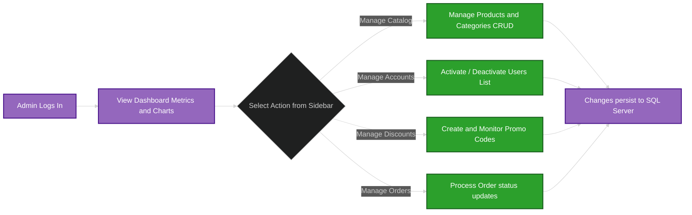

---

### 6.10.2 Customer Account Operations

This phase details the user identity steps (Epic 1) including registering, logging in, updating profile details, and changing credentials.

#### Step 1: User Registration
New visitors submit their email and details using the registration form. Client-side and server-side validation are enforced to meet security policies (e.g., strong password constraints), as shown in the screenshot below:

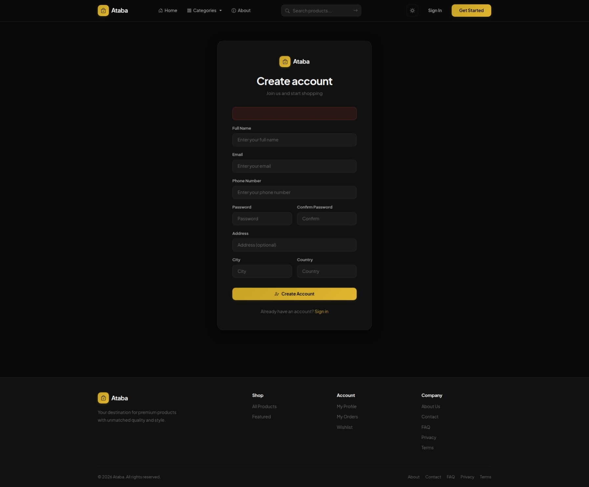

#### Step 2: User Login
Registered customers authenticate via the secure login portal using their credentials, setting a persistent authentication cookie upon success:

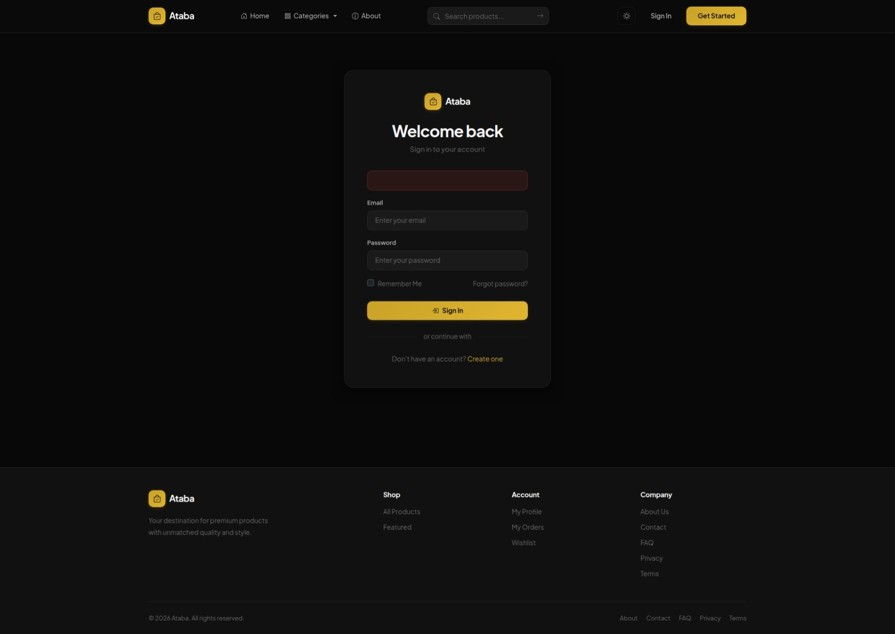

#### Step 3: Account Profile
Once logged in, the customer has access to a centralized profile dashboard showing their basic details, shipping address, and quick links to update their security settings:

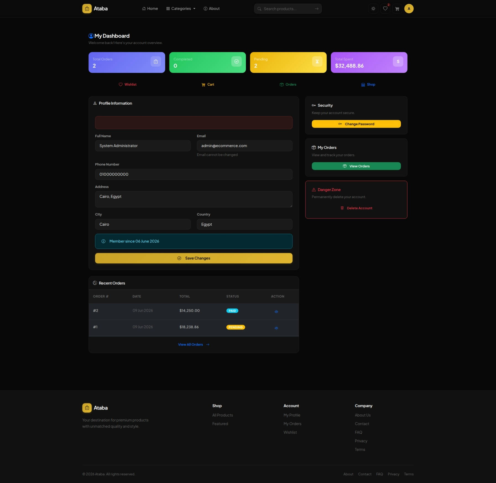

#### Step 4: Password Change Settings
From their profile, users can navigate to the password change form where they must supply their current password to establish a new one:

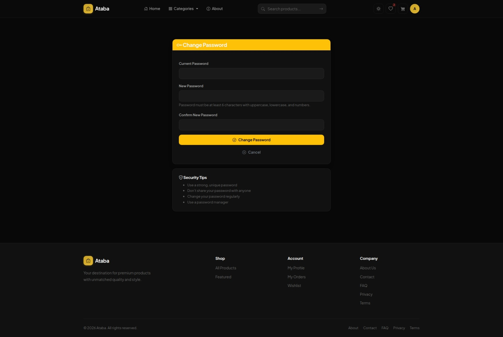

---

### 6.10.3 Customer Shopping & Checkout Journey

This phase covers product browsing, catalog searching, variant selection, AI integration, shopping cart management, checkout form completion, payment selection, and final order confirmation (Epics 2, 3, 4, 5).

#### Step 5: Product Catalog (Home Page & Filtering)
The default catalog view displays featured products and categories. The user can search or filter products by price and category via debounced AJAX calls that update the product grid asynchronously without a full page refresh:

- **Browse home view:** (Visualized in Section 1.6: `images/home.jpeg`)
- **Product catalog with sidebar filters:** (Visualized in Section 2.5: `images/products.jpeg`)

#### Step 6: Product Details and AI Q&A Assistant
Clicking on a product opens its detail page. Users can select variations (such as size/color) and trigger the real-time Google Gemini assistant to ask questions regarding the product:

- **Product details with variant selection & AI modal trigger:** (Visualized in Section 3.16.3 / Section 4.3.5: `images/product-details.jpeg`)

#### Step 7: Cart Management
Customers review selected items in their cart, change quantities dynamically, or remove items. The system calculates a running total including shipping and a 14% local tax:

- **Shopping cart layout:** (Visualized in Section 3.6: `images/cart.jpeg`)

#### Step 8: Checkout and Promo Coupon Application
At checkout, the user's shipping details are pre-filled. They can apply active promotional codes to recalculate totals and select cash on delivery or credit card payment options:

- **Checkout forms and promo code application:** (Visualized in Section 3.7: `images/checkout.jpeg`)

#### Step 8b: Stripe Card Checkout & Payment Monitoring
If the customer selects "Credit Card (Stripe)" as their payment option, they are redirected to a secure, dynamically generated Stripe Checkout portal to enter their payment details:

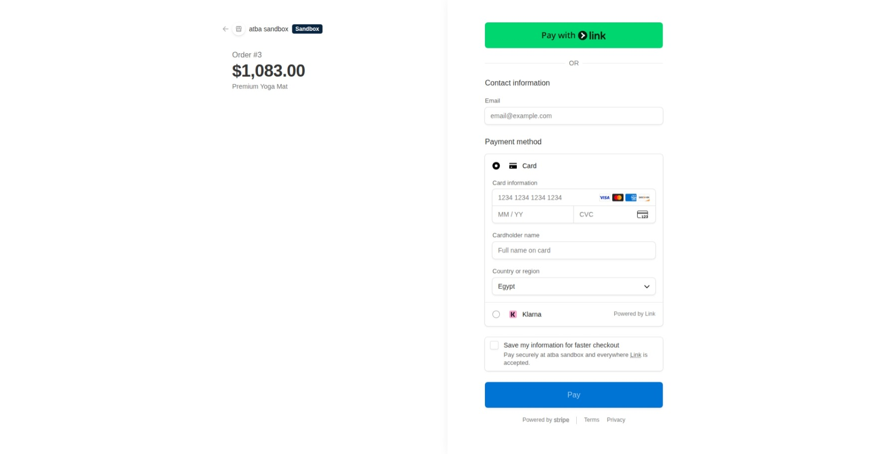

Once payment is processed, the system receives the return callback. Administrators can monitor incoming transactions, webhook logs, and audit histories directly inside the Stripe Merchant Dashboard:

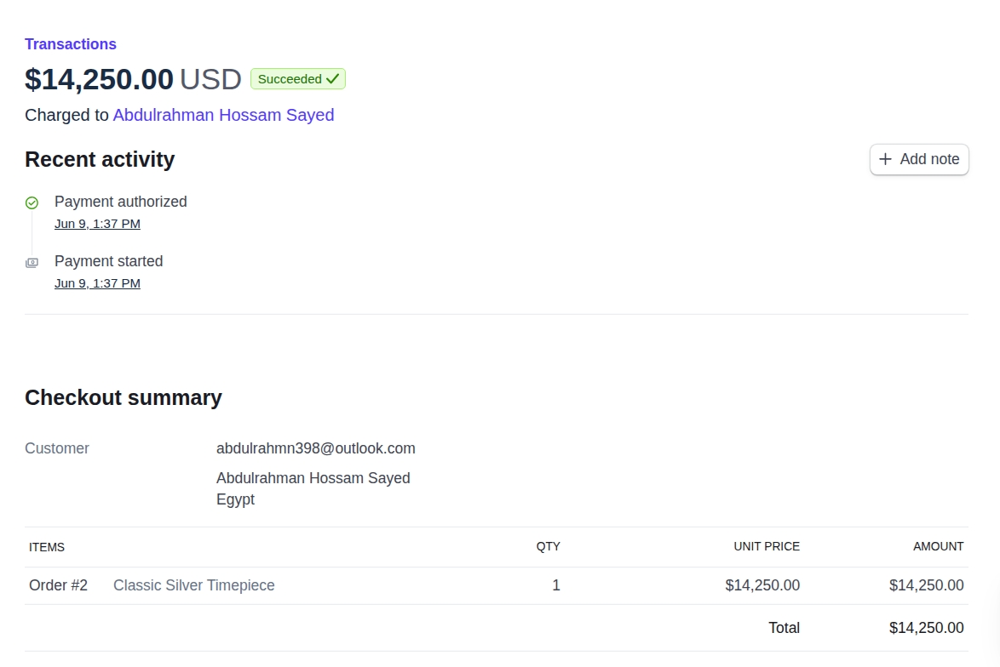

#### Step 9: Order Confirmation
Upon placement of a Cash on Delivery (COD) order, or on successful return from Stripe payment, the customer receives an immediate confirmation showing their invoice summary:

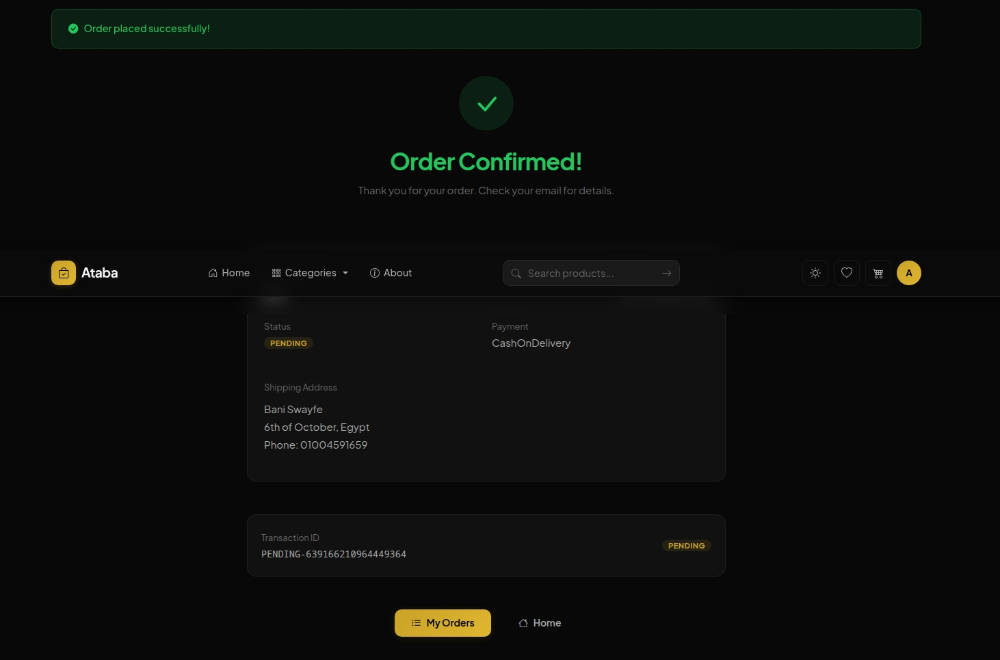

#### Step 10: Personal Order Details and History
Customers can view their transaction history from their profile to track the payment and delivery status of past orders:

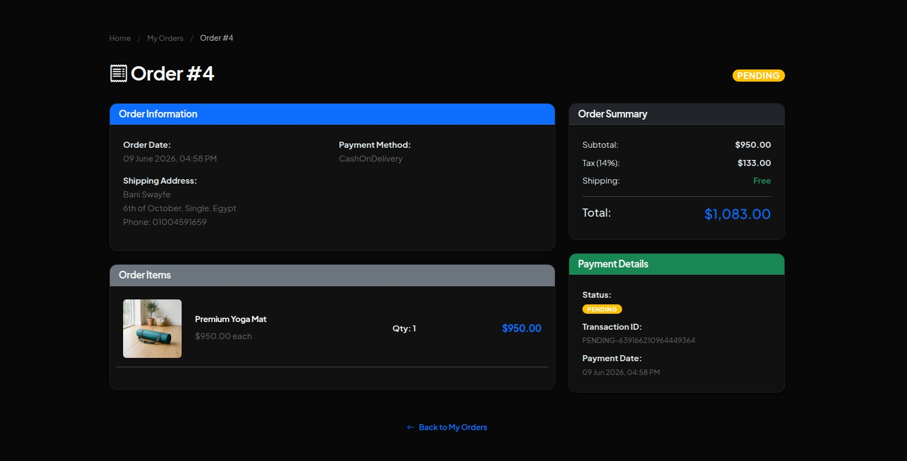

---

### 6.10.4 Administrator System Management

This phase traces administrative oversight, including dashboard charts, product/category CRUD, promo codes, user roles, and order processing (Epic 6).

#### Step 11: Admin Dashboard and Sales Reports
Administrators access a comprehensive dashboard showing sales statistics, order status summaries, and inventory warning levels:

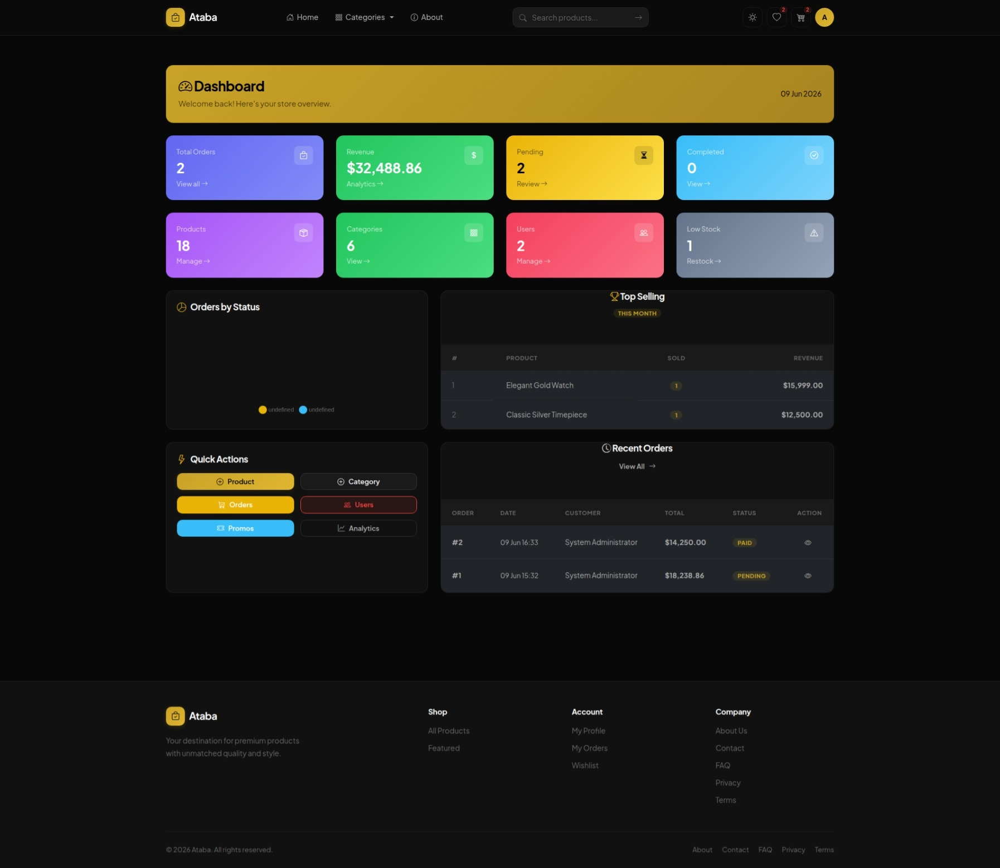

- **Detailed sales analytics with Chart.js visualization:** (Visualized in Section 5.11: `images/admin-anlyitcs.jpeg`)

#### Step 12: Admin Category CRUD
Admin operators maintain the product catalog. The category creation and modification view allows them to define category names, descriptions, and assign visual badges:

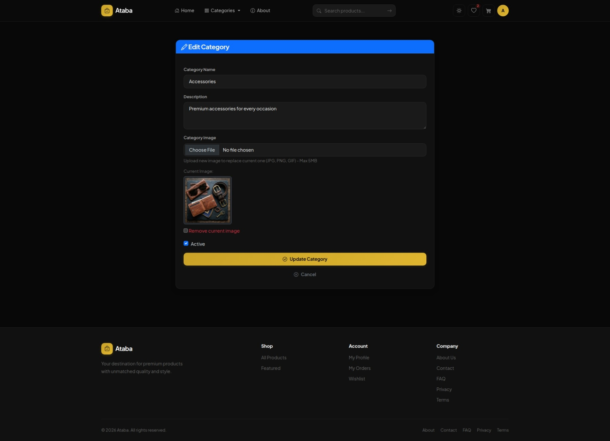

- **Main category management list:** (Visualized in Section 5.4: `images/admin-catigories.jpeg`)

#### Step 13: Admin Product CRUD
Admin operators upload product photos and configure description parameters:

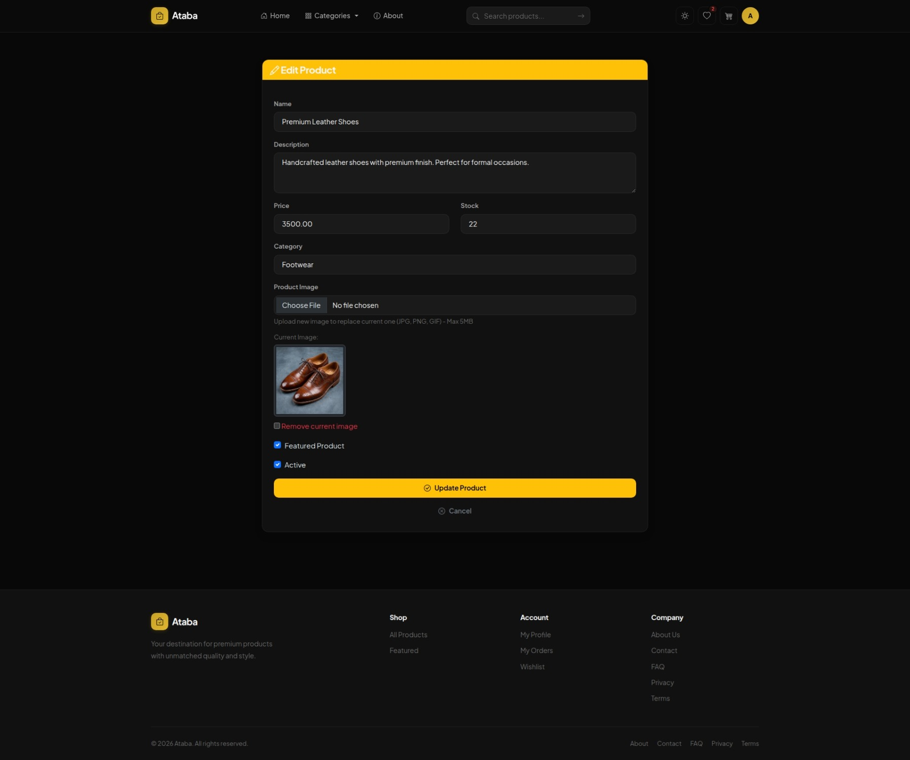

#### Step 14: User Accounts Management
Administrators can activate/deactivate user profiles, change roles, and check customer account statuses:

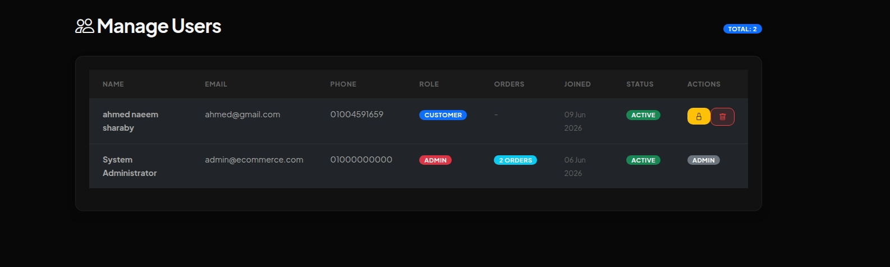

#### Step 15: Admin Order Processing and Status Updates
Administrators track client purchases, check transaction credentials, and trigger delivery progressions (from Pending to Paid, Shipped, and Delivered):

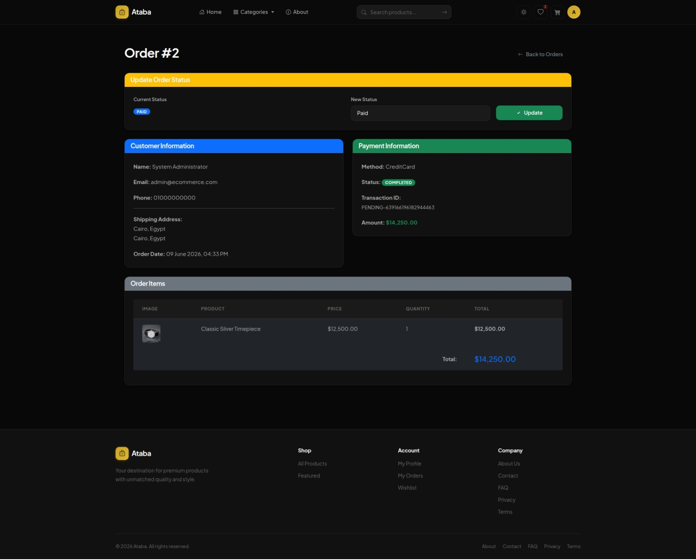

