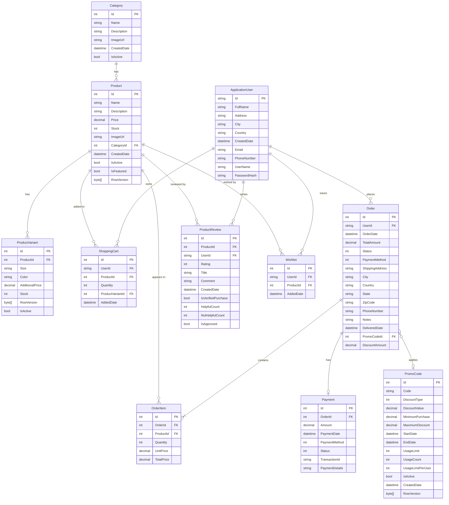
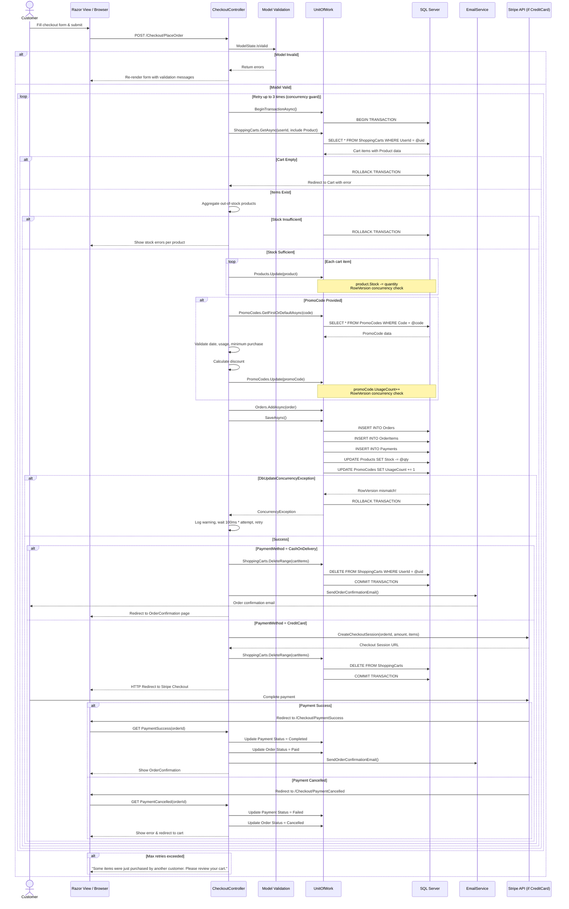

# Sec-7: System Modeling & Architectural Diagrams

## 7.1 Entity-Relationship Diagram (ERD)

The database schema of the ShopHub platform is built on **Microsoft SQL Server** and managed through **Entity Framework Core** using the Code-First approach. The schema models ten core entities that collectively support user management, product cataloging, shopping cart operations, order processing, payment tracking, promotional discounts, and customer reviews. The design enforces **referential integrity** through explicit foreign key constraints with carefully chosen cascade and restrict delete behaviours — for instance, deleting a `Product` cascades to its `ProductVariants` but restricts deletion if active `OrderItems` reference it. Monetary columns across all entities use a uniform `decimal(18, 2)` precision to ensure consistency in financial calculations. The following ERD captures the entities, their attributes, and the relationships between them:

The diagram illustrates seven **one-to-many** (1:N) relationships and one **one-to-one** (1:1) relationship between `Order` and `Payment`. The `PromoCode` relationship with `Order` is optional (many-to-one with `SET NULL` on delete), allowing orders to exist without a discount code while preserving the code's history for reporting. All foreign key columns are indexed through EF Core conventions or explicit configuration to maintain query performance under load.

---

## 7.2 System Use Case Diagram

The ShopHub platform defines **two primary actors** with distinct responsibilities and access levels:

- **Customer** — An authenticated user who can browse products, manage a shopping cart and wishlist, place orders via Cash on Delivery or Stripe credit card processing, apply promotional codes, submit product reviews, and interact with the AI-powered product assistant. Customers have access to their order history and profile settings.

- **Administrator** — A privileged user assigned the `Admin` role via ASP.NET Core Identity. Administrators have full access to the dashboard for viewing sales analytics and key performance indicators, managing the product catalog (CRUD operations on products and categories), overseeing user accounts (activation/deactivation and deletion), processing order status transitions, and monitoring inventory levels.

The following use case diagram captures the functional scope of the system from the perspective of each actor:

```mermaid
graph TD
    subgraph Actors
        C[Customer]
        A[Administrator]
    end

    subgraph "System Boundary"
        %% Authentication
        UC1[Register Account]
        UC2[Login / Logout]
        UC3[Reset Password]

        %% Product Browsing
        UC4[Browse Products]
        UC5[Filter & Sort Products]
        UC6[View Product Details]

        %% Customer Actions
        UC7[Manage Cart]
        UC8[Manage Wishlist]
        UC9[Place Order COD]
        UC10[Place Order Stripe]
        UC11[Apply Promo Code]
        UC12[Submit Product Review]
        UC13[Ask AI Assistant]
        UC14[View Order History]
        UC15[Edit Profile]

        %% Admin Actions
        UC16[View Dashboard & Analytics]
        UC17[Manage Products]
        UC18[Manage Categories]
        UC19[Manage Users]
        UC20[Manage Orders]
        UC21[View Sales Reports]
    end

    C --> UC1
    C --> UC2
    C --> UC3
    C --> UC4
    C --> UC5
    C --> UC6
    C --> UC7
    C --> UC8
    C --> UC9
    C --> UC10
    C --> UC11
    C --> UC12
    C --> UC13
    C --> UC14
    C --> UC15

    A --> UC2
    A --> UC16
    A --> UC17
    A --> UC18
    A --> UC19
    A --> UC20
    A --> UC21

    %% Include / Extend relationships
    UC9 -.->|extends| UC11
    UC10 -.->|extends| UC11
    UC4 -.->|includes| UC5
    UC4 -.->|includes| UC6
```

The diagram uses `include` relationships to show that browsing products inherently involves filtering and viewing details, and `extend` relationships to indicate that promo code application is an optional extension of the checkout flow. The authentication use cases (register, login, password reset) are shared across both actors, though administrators log in through the same Identity pipeline to access the admin area.

---

## 7.3 Checkout Sequence Diagram

The checkout process represents the most **architecturally critical transaction** in the system. It must atomically validate inventory levels, deduct stock quantities, apply promotional discounts, create order and payment records, and clear the user's cart — all while handling **concurrent access** from multiple shoppers. The system employs a **database-level transaction** (`BeginTransactionAsync`) wrapped in a **retry loop** of up to three attempts to resolve optimistic concurrency conflicts detected via the `[Timestamp] RowVersion` columns on `Product`, `ProductVariant`, and `PromoCode` entities. The following sequence diagram traces the exact message flow for a Cash on Delivery (COD) order, which represents the simplest payment path while still exercising the full transaction pipeline:

The sequence diagram highlights several architectural decisions:

1. **Transaction boundary** — The `BEGIN TRANSACTION` and `COMMIT/ROLLBACK` operations bracket all write operations, ensuring atomicity. If any `UPDATE`, `INSERT`, or `DELETE` fails, the entire operation rolls back.

2. **Stock validation before writes** — All out-of-stock products are identified and reported to the user before any stock deduction occurs, preventing partial failures.

3. **Concurrency retry loop** — The `DbUpdateConcurrencyException` triggers a full rollback, a logarithmic wait (100ms × attempt number), and a retry that re-reads fresh data from the database. This resolves conflicts where two users purchase the last unit of the same product simultaneously.

4. **Payment method branching** — The COD path completes the transaction immediately and sends a confirmation email. The Stripe path delegates payment to the external gateway and handles the callback via two dedicated endpoints (`PaymentSuccess` and `PaymentCancelled`), which update the order and payment statuses accordingly.

5. **Email delivery** — The confirmation email is sent outside the transaction boundary (after commit) and is wrapped in a try/catch so that a transient email failure does not invalidate the completed order.
